<details>
	<summary><i>Obsidian Properties Screenshot</i></summary>
	
	#rise-dcl-log
</details> 

- [Sources](#sources)
	- [ROS](#ros)
	- [SpecRLBench](#specrlbench)
		- [Repositories](#repositories)
		- [Documentation](#documentation)
		- [Miscellaneous](#miscellaneous)
- [Papers](#papers)
- [Task Levels](#task-levels)
- [TODO](#todo)
- [06-29-26](#06-29-26)
	- [Old Command](#old-command)
	- [New Command](#new-command)
- [06-30-26](#06-30-26)
	- [Issues & Solutions](#issues--solutions)
	- [New Understandings](#new-understandings)
- [07-01-26](#07-01-26)
	- [Instructions for SpecRLBench Dev](#instructions-for-specrlbench-dev)
	- [Setting up SpecRLBench](#setting-up-specrlbench)
- [07-02-26](#07-02-26)
	- [07-02-06 Papers](#07-02-06-papers)
		- [Mock-Up](#mock-up)
		- [GitHub Repositories](#github-repositories)
- [07-03-26](#07-03-26)
	- [Making Walls](#making-walls)
		- [Initial Setup](#initial-setup)
		- [Ringed Placements](#ringed-placements)
		- [Random Sizing](#random-sizing)
	- [Making Buildings](#making-buildings)
		- [Initial Thoughts](#initial-thoughts)
		- [Border Placement](#border-placement)
		- [Spawning Buildings](#spawning-buildings)
- [07-04-26](#07-04-26)
	- [Vision](#vision)
	- [Casualties](#casualties)
		- [Initial Thoughts](#initial-thoughts)
		- [Surface](#surface)
		- [Entrapped](#entrapped)
- [07-05-26](#07-05-26)
		- [Custom Environment Name Creation/Changes](#custom-environment-name-creationchanges)
- [07-06-26](#07-06-26)
	- [Agent Spawn Parameters](#agent-spawn-parameters)
	- [Pseudo Lidar Reversion](#pseudo-lidar-reversion)
	- [Building Walls](#building-walls)
		- [Manual Configurations](#manual-configurations)
		- [Automatic Configurations](#automatic-configurations)
	- [Miscellaneous Tweaks](#miscellaneous-tweaks)
		- [Naming Tweaks](#naming-tweaks)
		- [Better Building Spawning](#better-building-spawning)
		- [Color Additions](#color-additions)
		- [EOD Pictures](#eod-pictures)
- [07-07-26](#07-07-26)
	- [Keyboard Movement](#keyboard-movement)
	- [Rewards and Punishments](#rewards-and-punishments)
	- [Distance-and-Geom Natural Lidar Detection](#distance-and-geom-natural-lidar-detection)
		- [The Issue](#the-issue)
		- [Idea A - Natural Lidar Identified](#idea-a---natural-lidar-identified)
		- [Idea B - Pseudo Lidar Occluded](#idea-b---pseudo-lidar-occluded)
		- [Debugging Idea B](#debugging-idea-b)
	- [Miscellaneous Tweaks](#miscellaneous-tweaks)
- [07-08-26](#07-08-26)
	- [Meeting with Dr. Li](#meeting-with-dr-li)
	- [Migrating to BU-DEPEND-Lab](#migrating-to-bu-depend-lab)
	- [Remote Desktop Setup](#remote-desktop-setup)
	- [PPO Setup](#ppo-setup)
	- [Literature Review](#literature-review)
	- [Papers](#papers)
		- [Learning About PPO](#learning-about-ppo)
		- [PPO Variations](#ppo-variations)
- [07-09-26](#07-09-26)
	- [SAR Levels](#sar-levels)
		- [More Env Scripts](#more-env-scripts)
	- [SAR Task Integration](#sar-task-integration)
		- [Action Space](#action-space)
		- [Observation Space](#observation-space)
		- [Reward, Terminated, Truncated Flattening](#reward-terminated-truncated-flattening)
	- [PPO Reward Engineering](#ppo-reward-engineering)
- [07-10-26](#07-10-26)
	- [Lower Rollout Sample Steps](#lower-rollout-sample-steps)
	- [casualty_lidar_ids](#casualty_lidar_ids)
	- [Rewards Revisions and Reversions](#rewards-revisions-and-reversions)
		- [Idea A - Lidar-Scaled Dense Rewards](#idea-a---lidar-scaled-dense-rewards)
		- [Idea B - Approach Reward](#idea-b---approach-reward)
	- [Weekly Status Report](#weekly-status-report)
	- [EOD](#eod)
- [7-11-26](#7-11-26)
- [7-12-26](#7-12-26)
- [7-13-26](#7-13-26)
	- [Faster Layout Resampling](#faster-layout-resampling)
	- [Per-Agent Tracking Cameras](#per-agent-tracking-cameras)
	- [Separate Train/Load Scripts](#separate-trainload-scripts)
	- [Hyperparameter Changes](#hyperparameter-changes)
	- [Reward Logic Migration](#reward-logic-migration)
		- [Side-Note: Tensorboard Graphing](#side-note-tensorboard-graphing)
- [7-14-26](#7-14-26)
	- [Evaluation Changes](#evaluation-changes)
		- [Evaluation Metrics](#evaluation-metrics)
		- [Reproducibility](#reproducibility)
		- [Miscellaneous](#miscellaneous)
	- [Training Changes](#training-changes)
		- [Hyperparameter Configurability](#hyperparameter-configurability)
- [7-15-26](#7-15-26)
	- [Entrapped Casualties Pivot](#entrapped-casualties-pivot)
		- [Building Randomization](#building-randomization)
	- [Wall Collision Punishment](#wall-collision-punishment)
	- [Code Testing](#code-testing)
	- [Next Steps](#next-steps)
- [7-16-26](#7-16-26)
	- [Meeting with Dr. Li](#meeting-with-dr-li)
	- [Intrinsic Rewards](#intrinsic-rewards)
	- [Random Network Distillation](#random-network-distillation)
		- [SB3 Integration](#sb3-integration)
	- [Ignore Building After Entry](#ignore-building-after-entry)
- [7-17-26](#7-17-26)
- [07-20-26](#07-20-26)
- [07-21-26](#07-21-26)

# Sources
## ROS
- [ROS Ubuntu Installation](https://wiki.ros.org/noetic/Installation/Ubuntu) 
- [Information Slideshow](https://docs.google.com/presentation/d/1C7Mwcdt3m7QfknjxOcZXIfugGhLVEKumrAQWOlkqRtM/edit?pli=1&slide=id.p#slide=id.p) 
- [tf tutorials](https://wiki.ros.org/tf/Tutorials) 
- [geometry msgs wiki](https://docs.ros.org/en/noetic/api/geometry_msgs/html/index-msg.html) 
- [pubsub with python](https://wiki.ros.org/ROS/Tutorials/WritingPublisherSubscriber(python)) 
- [frames](/_pages/rise/frames.pdf)
## SpecRLBench
### Repositories
- [SpecRLBench](https://github.com/BU-DEPEND-Lab/SpecRLBench) 
- [RISE Python Training](https://github.com/akhaled247/rise_python_training/tree/main) 
- [akhaled247/SpecRLBench](https://github.com/akhaled247/SpecRLBench) 
- [BURISE-26 Project Repository](https://github.com/BU-DEPEND-Lab/RISE-2026) 
- [SB3 GitHub Repo](https://github.com/DLR-RM/stable-baselines3/tree/master) 
- [MARLlib (IPPO Impl)](https://github.com/Replicable-MARL/MARLlib/blob/master/marllib/marl/algos/scripts/ippo.py)
- [SAR MARL](https://github.com/elte-collective-intelligence/student-search#abstract)
### Documentation
- [Gymnasium Documentation](https://gymnasium.farama.org/tutorials) 
- [MuJoCo Creating Models](https://mujoco.readthedocs.io/en/latest/XMLreference.html) 
- [RL Baselines3 Zoo](https://stable-baselines3.readthedocs.io/en/master/guide/rl_zoo.html) 
- [SB3 PPO](https://stable-baselines3.readthedocs.io/en/master/modules/ppo.html) 
- [MARLlib (PPO Family)](https://marllib.readthedocs.io/en/latest/algorithm/ppo_family.html#proximal-policy-optimization-a-recap)
### Miscellaneous
- [SARE Spawning Zone Desmos Calculator](https://www.desmos.com/calculator/bcqjpzneh6) \
- [TensorBoard (localhost)](http://localhost:6006/?pinnedCards=[{%22plugin%22%3A%22scalars%22%2C%22tag%22%3A%22train%2Fexplained_variance%22}%2C{%22plugin%22%3A%22scalars%22%2C%22tag%22%3A%22train%2Floss%22}%2C{%22plugin%22%3A%22scalars%22%2C%22tag%22%3A%22train%2Fvalue_loss%22}%2C{%22plugin%22%3A%22scalars%22%2C%22tag%22%3A%22train%2Fstd%22}]&darkMode=true#timeseries&runSelectionState=eyJQUE9fMSI6ZmFsc2UsIlBQT18yIjpmYWxzZSwiUFBPXzMiOnRydWUsIlBQT180IjpmYWxzZSwiUFBPXzUiOnRydWV9) \
- [Practical Tips For Reliable RL](https://araffin.github.io/slides/tips-reliable-rl/) 
# Papers
| URL                                                              |
| ---------------------------------------------------------------- |
| https://www.intechopen.com/chapters/56080                        |
| https://arxiv.org/pdf/2506.06136                                 |
| https://arxiv.org/pdf/2308.00331                                 |
| https://arxiv.org/pdf/2604.24729v1                               |
| https://arxiv.org/pdf/2102.06069                                 |
| https://ieeexplore.ieee.org/stamp/stamp.jsp?tp=&arnumber=9220149 |
| https://ieeexplore.ieee.org/stamp/stamp.jsp?arnumber=10876050    |
# Task Levels
- Level 0:
- Level 1: Rescue portion of search & rescue
	- Gremlin pos teleportation code, once found and interacted with then pick up and take to spawning circle (zone?).
- Level 2: Human collaborators
	- Moving target geom, build on that probably
# TODO
> Based on meetings with Zijian and mentor-mentee agreement goals
- ~~*Agent spawning inner radius*~~
- ~~Change building spawning to have walls around them (extend `LTLWall`)~~
- ~~*Lidar observed = false for entrapped casualties, revert to `pseudo` lidar*~~
- ~~identify rewards/punishments~~
- ~~Test manually (i.e. keyboard)~~
- ~~take each lidar observation for each lidar_observable , find the smallest number, and set the other lidar_observable numbers for that ray to 0~~
- Policy - ~~Use existing libraries (stable baselines; PPO) - start with simple tasks (e.g. go to a location~~), then expand to more complicated tasks
	- ~~StableBaselines (install conda, then have folder with SpecRLBench~~ 
	- ~~For policy training use lambda machine~~
- ~~Migrate `BURISE-2026` personal repo to `BU-DEPEND-Lab`~~
- ~~Debug new level system~~
- ~~Format `action`, `obs`, `info` space so that it works with PPO vis  ~~
- Leave RND for now; first, ~~work on terminating when colliding with walls~~ with one building. then, ~~add cost for exiting and re-entering a building to punish repeated detections~~
- ~~Provide estimated position of agent (e.g. zone) as part of observation space~~
- ~~Give reward for entering that zone~~
- ~~Give reward for finding casualty~~
- ~~cost for collisions to walls or terminate (test)~~
- ~~surface casualties ~~
- ~~multiple buildings, some have casualties~~
- LLM where we specify agent and casualties and explain what to avoid etc. and have LLM generate high level plan, call low level controller (A*, something else)

# 06-29-26
We attempted to set up ROS Noetic on Ubuntu 20.04 within a docker container within a remote desktop. Initially, this is the command we chose:
## Old Command

```Shell
docker create \
 --name workspace \
 --gpus all \
 --net=host \
 -e DISPLAY=$DISPLAY \
 -v /tmp/.X11-unix:/tmp/.X11-unix \
 -v /home/akhaled/workspace:/home/akhaled/workspace \
 -w /home/akhaled/workspace \
 ubuntu:20.04 \
 tail -f /dev/null
```
However, since that did not work, we went with this command, that created a ROS Noetic container directly in Docker rather than having another layer of abstraction. So, we created a ROS Docker container in a remote desktop. 
## New Command

```sh
docker run -it \
  --name=ros_noetic \
  --net=host \
  --gpus all \
  -e DISPLAY=$DISPLAY \
  -e NVIDIA_DRIVER_CAPABILITIES=all \
  -v /tmp/.X11-unix:/tmp/.X11-unix:rw \
  osrf/ros:noetic-desktop-full
  
docker exec -it ros_noetic bash
```
After that, we had to install the rest of the ROS suite, which we completed using these commands. \ *Note: the Sawyer robot repo is years out of date, so some of the dependencies were outdated. We just tried our best with what we had and ignored the useless depends.*
```sh
apt update
apt-get install git-core python3-wstool python3-vcstools python3-rosdep ros-noetic-control-msgs ros-noetic-joystick-drivers ros-noetic-xacro ros-noetic-tf2-ros ros-noetic-rviz ros-noetic-cv-bridge ros-noetic-actionlib ros-noetic-actionlib-msgs ros-noetic-dynamic-reconfigure ros-noetic-trajectory-msgs ros-noetic-rospy-message-converter

apt install python3 python3-pip python3-venv

pip install argparse

mkdir ros_ws
cd ros_ws
mkdir src

wstool init .

apt install git
cd src
git clone https://github.com/RethinkRobotics/sawyer_robot.git
wstool merge sawyer_robot/sawyer_robot.rosinstall
wstool update
source /opt/ros/noetic/setup.bash
catkin_make

apt-get install gazebo11 ros-noetic-gazebo-ros  ros-noetic-gazebo-ros-control
ros-noetic-gazebo-ros-pkgs ros-noetic-ros-control ros-noetic-control-toolbox ros-noetic-realtime-tools
apt-get install gazebo11 ros-noetic-gazebo-ros  ros-noetic-gazebo-ros-control  ros-noetic-gazebo-ros-pkgs ros-noetic-ros-control ros-noetic-control-toolbox ros-noetic-realtime-tools  ros-noetic-ros-controllers ros-noetic-xacro python3-wstool ros-noetic-tf-conversions ros-noetic-kdl-parser

cd src

git clone https://github.com/RethinkRobotics/sawyer_simulator.git -b noetic_devel
git clone https://github.com/RethinkRobotics-opensource/sns_ik.git -b melodic-devel

rm .rosinstall
wstool init .
wstool merge sawyer_simulator/sawyer_simulator.rosinstall
wstool update

cd ..
source /opt/ros/noetic/setup.bash
catkin_make

cd src/sawyer_simulator/sawyer_gazebo/src
apt install nano
nano head_interface.cpp

cd /ros_ws/src/sawyer_simulator/sawyer_gazebo/src/head_interface.cpp line 71:
  cv_ptr->image = cv::imread(img_path, cv::IMREAD_UNCHANGED);
  
 catkin_make 
 
 cd ros_ws
 . devel/setup.bash
 roslaunch sawyer_sim_examples sawyer_pick_and_place_demo.launch
```
# 06-30-26
We are now trying to see the simulator in the remote desktop via NoMachine. Before, we had SSHed into the remote desktop using `ssh <user>@10.210-22-197`, but since we needed the Gazebo simulation visualizer to actually understand what was happening, so we had to set up a remote desktop. \
*Note: make sure you ssh out of the device before connecting with remote desktop connection
`pkill -u $USER -f Xorg`*
## Issues & Solutions
- Python 3 errors: `ln -s /usr/bin/python3 /usr/bin/python`
* Syntax error in `/root/ros_ws/src/sawyer_simulator/sawyer_sim_examples/scripts/ik_pick_and_place_demo.py`
	- Have to write `as e` instead `of , e` (three exceptions)
- We had an issue where the interpolation for the robotic arm to come down onto the block. `_servo_to_pose` was linear, which didn't work for quaternions due to unit vector math that meant that linear interpolation would make the length of the vector `!= 1`
	- Solution: we reduced the step size to 1 so that we did not have to worry about intermediate steps. since we are only working with cartesian movements, this wasn't a huge worry
- The initial block pose was inaccurate, since it was manually set by the Sawyer devs
	- We found out how to find the block pose using the Gazebo sim GUI
- The block pose was not dynamic (i.e. if the block got moved, the robot didn't know where to go)
1. Learned how `rostopic` works and found the topic that published information about the coordinates of the scene objects
	* `rostopic list`
2. Learned how to subscribe to the topic in the CLI and found the type of the message that was being published
	* `rostopic info /gazebo/model_states` >> `ModelStates`
  3. Learned about pub/sub in python (!= CLI) and how to parse the data
  4. Learned about what `tf` library does and began to implement using CLI first
  5. Then learned how to use it in code using tutorials above. also what a frame was and how to perform type manipulation (i.e. `Point` <==> `Vector3`)
  6. Had to offset the position due to unknown reasons (likely because model is somewhat inaccurate), though it might also be because of something with the simplified orientation calculations we did (*Note: Later, we found out that it was because the origin of the pose was not the center of the objects, but one of the vertices.*)
## New Understandings
* Learned more about the CLI, especially became comfortable with `nano` in Linux
* Understood `try except finally` blocks and how to handle exceptions gracefully
* Learned Python class structure through the creation of the `DataSubcriber` class
# 07-01-26
I talked with Zijian about his project and received confirmation from Dr. Li to work with Zijian on [SpecRLBench](https://github.com/BU-DEPEND-Lab/SpecRLBench), with the following instructions:
## Instructions for SpecRLBench Dev
- Try out the current SpecRLBench, getting familiar with the Gym setup
- Come up with real-world scenario-inspired examples for the multi-agent setting,
- Create the corresponding environments or modify existing environments for the examples,
- Formalize the requirements in our multi-agent spec language
- train and evaluate agents that use vision as inputs

Towards these goals, I started learning the foundational skills and frameworks that SpecRLBench is using, which I am tracking in [RISE Python Training](https://github.com/akhaled247/rise_python_training/tree/main)
As part of this training, I have learned
- Python syntax for control systems, classes, and overall how code is structured in Python
- Gymnasium: Basic setup, hyperparameters, Q-Learning, REINFORCE algorithm with Mudoco \
*Note: There is more to the training, but at this point, I received the email from Dr. Li regarding what I should focus on, so I pivoted to directly working on the SpecRLBench stuff.*

## Setting up SpecRLBench
Unlike in the tutorial, I didn't have to run `cd specbench` since the install file was in the main folder  
I also had to run these commands:
```bash
conda create -n specbench python=3.10
conda activate specbench
pip install -e .
pip install -e specbench/envs/panda-gym
pip install -e specbench/envs/zones/safety-gymnasium
```
instead of `./install.bash` because <u>a)</u> the script was `install.sh` and <u>b)</u> I would get this error:  
```bash
(specbench) C:\GitHub\rise_project\SpecRLBench>./install.sh
  '.' is not recognized as an internal or external command,
  operable program or batch file.
```
- ~~TODO: Learn how to make custom environments in gymnasium~~
- Create custom environment
- Lit review of current search-and-rescue operation environment definitions

I then started exploring more into the `safety-gymnasium` and its environments, and found the [Building Button](https://safety-gymnasium.readthedocs.io/en/latest/environments/safe_vision/building_button.html) environment, which seems to be similar to the search-and-rescue operations I am interested in. This env also incorporates vision (optional), which is something I can look into.

# 07-02-26

I started the day out by trying to understand how environments are created. A running list of classes I have found are below:
`builder.py` - this is the builder of the environments, which is where the world is constructed (inluding obstacles)
- `__init.py__` - this is where all of the environments are created when you run `pip install -e .` 
- `world.py` - this is the world that includes the observation space
- `\base` - this is where all of the "template" files are included
	- `underlying` - the source of all of the base files
	- `base_task` - the template for creating tasks
- `\ltl` - the directory where all of the LTL-specific tasks are created
	- `ltl_base_task` - built off of `base-task`, it allows the user to encode LTL tasks. Used by other ltl tasks in `\ltl`
- *Note: These tasks must be imported into the `__init.py__` file in the `\tasks` directory* \
After exploring the repository more, I was able to create my own custom task `multi-goal-level3` and my own gym wrapper `safety_gym_wrapper_ma_sro` and integrate them into the existing codebase. \
After that, I moved on to diving deeper into how simulation environments for search and rescue (SAR) environments are currently constructed. Below are all of the papers that I have analyzed so far to learn about how to make a new environment that would satisfy the goals outlined in the presentation provided. 
## 07-02-06 Papers
#### [Unmanned Ground Robots for Rescue Tasks](https://www.intechopen.com/chapters/56080)
Simulation uses a grid map, but also uses point-cloud mapping to construct a 3D visualization of the environment.
#### [UAV-UGV Cooperative Trajectory Optimization and Task Allocation for Medical Rescue Tasks in Post-Disaster Environments](https://arxiv.org/pdf/2506.06136)
- Trying to create tasks for multiple agents, with each task being completed individually.
- Using [[Genetic Algorithm]]s, which are better for complex environments. Selects the highest-fitness individuals and mutates them.
- Each agent is assigned one task unique to them
- Minimum safety distance away from vehicle
- Obstacles represented as circles (zones!!!), all vehicles spawn in the same place
https://github.com/Cherry0302/disaster_uav_ugv_rescue_planner
#### [Target Search and Navigation in Heterogeneous Robot Systems with Deep Reinforcement Learning](https://arxiv.org/pdf/2308.00331)
 \
>[!quote]
>The black lines denote the wall and the sphere-represented victim randomly appears in one of the two branches during the environment generation
#### [SpecRLBench.. A Benchmark for Generalization in Specification-Guided Reinforcement Learning](https://arxiv.org/pdf/2604.24729v1)
- Benchmark for testing different spectulation-guided RL models (hence [SpecRLBench](SpecRLBench..%20A%20Benchmark%20for%20Generalization%20in%20Specification-Guided%20Reinforcement%20Learning.md) name). Currently, there are 19 environments to choose from, split between **navigation** and **manipulation** tasks. I don't understand how the environments are dynamically created, so I will have to look into that.
#### [Search Planning of a UAV-UGV Team with Localization Uncertainty in a Subterranean Environment](https://arxiv.org/pdf/2102.06069)
 \
Simulation environment was more realistic (using Gazebo simulator)
- Included irregular models, but was essentially a cylinder cut in half and hollowed out
- Sensors included LIDAR and two cameras -- one facing upwards, and one facing forwards. This was done to map out the entire environment since it was a 3D space (by contrast, the [SpecRLBench](SpecRLBench..%20A%20Benchmark%20for%20Generalization%20in%20Specification-Guided%20Reinforcement%20Learning.md) workspace is effectively 2.5D)
#### [Collaborative Multi-Robot Search and Rescue.. Planning, Coordination, Perception, and Active Vision](https://ieeexplore.ieee.org/stamp/stamp.jsp?tp=&arnumber=9220149)
- Simulation for SAR environments should be more robust than traditional applications since the environment is often more complex than traditional environments.
- **Sim2Real** methods
- Important to consider noisy data, unbalanced data, and conflicting data as potential issues when abstracting away certain parameters
- May be useful to consider creating some of these disruptions within the simulator to increase its realism

(10/27) Multi-Robot Task Allocation
- Most often these are centralized, but decentralized approaches are more robust for the types of environments they operate in (especially SAR environments)
- Market-based approaches and auctions
- Liu et al. -- Potentially use a supervised system to adapt the robot when new situations occur
#### [A Heterogeneous Unmanned Ground Vehicle and Blimp Robot Team for Search and Rescue using Data-driven Autonomy and Communication-aware Navigation](https://ieeexplore.ieee.org/stamp/stamp.jsp?arnumber=10876050)
- Teams were given points based on how many "artifacts" they found and reported to the correct location (not individuals)
- UAVs and UGVs worked together to a) map out the environment and b) find the aforementioned artifacts (e.g. person, backpack, items, etc.)
- Real-world environments (not super helpful for understanding how simulations should be made)
- UAVs (blimps) were used in mazes and trajectories were mapped out

Once I finished reading those papers, I constructed a mock-up of the environment and task that I hope to complete:
### Mock-Up
 \
The obstacles, victims, buildings, and casualties will all be randomized (easier than static placements), and the agents will always spawn near the center. This way, there is a good balance between randomness (which is required to prevent an overfitted policy) and structure (since otherwise, the simulation would not be realistic).
### GitHub Repositories
##### [akhaled247/SpecRLBench](https://github.com/akhaled247/SpecRLBench)
This is a fork of the SpecRLBench repository, where i am developing the environment as explains above.
##### [akhaled247/BURISE-26](https://github.com/akhaled247/BURISE-26)
This is the repository where I'm housing the work that I have done. Currently, it just has the SpecRLBench submodule, but I may add other directories if needed.  [TODO: Ask for recommendation/permission to move repo to BU-DEPEND-LAB] 

# 07-03-26
We have off since it's a federal holiday, but I wanted to continue working on at least the task environment so that it was easier to implement higher-level features nearing the end of my internship.
I keep getting this error,
```sh
 assert all(cost[agent]['cost_sum'] == 0 for agent in self.possible_agents), f'World has starting cost! {cost}'
AssertionError: World has starting cost! {'agent_0': {'wall_sensor': array([0.01272425, 0.23717354, 0.10691148, 0.00573575]), 'cost_ltl_walls': 0, 'cost_zones_gray': 0, 'cost_zones_magenta': 0, 'cost_zones_red': 0, 'cost_collision': 0, 'cost_sum': 0}, 'agent_1': {'wall_sensor': array([0.00435828, 0.01436281, 0.31213399, 0.09471465]), 'cost_ltl_walls': 0, 'cost_zones_gray': 0, 'cost_zones_magenta': 0, 'cost_zones_red': 1, 'cost_collision': 0, 'cost_sum': 1}, 'agent_2': {'wall_sensor': array([0.05111625, 0.11643658, 0.02661322, 0.01168334]), 'cost_ltl_walls': 0, 'cost_zones_gray': 0, 'cost_zones_magenta': 0, 'cost_zones_red': 0, 'cost_collision': 0, 'cost_sum': 0}, 'agent_3': {'wall_sensor': array([0.01516125, 0.01623947, 0.08972661, 0.08376926]), 'cost_ltl_walls': 0, 'cost_zones_gray': 0, 'cost_zones_magenta': 0, 'cost_zones_red': 0, 'cost_collision': 0, 'cost_sum': 0}, 'agent_4': {'wall_sensor': array([0.05635487, 0.38731112, 0.02413932, 0.00351234]), 'cost_ltl_walls': 0, 'cost_zones_gray': 0, 'cost_zones_magenta': 0, 'cost_zones_red': 0, 'cost_collision': 0, 'cost_sum': 0}}
```
Which, according to AI, boils down to the world being too crowded, resulting in an environment that already has costs associated with it. To combat this, I reduced the number of agents. After this, I started working on making the walls.
## Making Walls
### Initial Setup
There were multiple issues I faced while I was trying to make the walls. First, I had to learn how to make a new geom. The existing wall geom was a stub, or simply a template that did not have the necessary parameters to exist in the simulated environment. So, I took the code from the `pillars` geom as a reference for creating the walls, since they share many of the same properties. Initially, here is what I had to change:
1. `size`: With the pillars, `size` was just a float value that represented the radius of the `cylinder`. However, for the walls, they were of `type: 'box'`. As such, I had to change this parameter to **`half_sizes`**, which was of type `list` that took in three variables, `[x, y, z]`, that represented how far from the center the wall would extend in 3D. This also meant that the position of the box in the configuration was `'pos': np.r_[xy_pos, half_sizes[-1] + 1e-5]`, where `half_sizes[-1]` was the final (z) element of the list.
2. `type`: As mentioned previously, I had to change the type of the obstacle to `box` so that it wasn't a cylinder.
3. `name`: The name of the geom was changed to `"walls"` since when the `pos(self)` method is called, it will return `wall_N` where N represents the index of that wall. \
This allowed me to render the wall for the first time in the simulation, which was quite exciting. They had random positions, which is what I wanted, but they would intersect with the ring that I wanted to leave for the agents.
### Ringed Placements
So, I started working on making the walls spawn in a specified ring. Below were the requirements I set:
1. The ring's inner/outer radius had to be specifiable, ideally with a +-margin of error
2. The ring had to have a hollow center, such that agents could be placed within that inner ring
3. Walls had to be able to be placed randomly along that ring: I didn't want them to spawn in the same place every time
4. Wall spawning would ideally be controlled by `random_generator.py`. This way, the initial seed would be the sole determinant of the randomness, meaning that the simulation wouldn't change between runs unless the seed was changed \
I first started with trying to understand how the `placements` attribute worked for geoms, which I found explained [here](https://safety-gymnasium.readthedocs.io/en/latest/components_of_environments/objects.html#general-parameters) in the safety-gym docs. I learned that placements are boxes, constrained by (x,y) coordinates from the origin, that specify a region that the object's origin can be located. Placements can either be a single 4-tuple (i.e. `(x_min, y_min, x_max, y_max)`) or they can be a 1D array of these regions (i.e. a `list`). However, there was an issue since I wanted a ring, I would have to take multiple samples along the ring radius and create boxes from them. Therefore, I had to convert the polar coordinates `(r, θ)` into `(x, y)` using trigonometry, then created a box with dimensions `2 * margin` around that central point. I used `WALL_COUNT` samples so that the walls would be approximately spaced around the ring, and forced the margin to be larger than the `keepout` (if no margin specified). That created an environment that looked like this:
 
### Random Sizing
However, I also wanted the sizes of the walls to be different. So, I initially created a method (taking code from the `ring_placements()` method) that allowed me to create `n` len=3 arrays that would output `[x, y, z]` so that the dimensions were random every time. That was a little *too* random, though: each run, instead of preserving the values based on the original seed, the method would return a new list of half_sizes. This was because I was using `np.random` to create the lists rather than `self.random_generator` because the latter does not initialize until after `reset()` has been called in the task.
So I changed how the random sizing was stored. Instead of a new instance of the list being created every time the `test_env.py` is run, there is a `_cached_wall_half_sizes` variable that is initially set to `None` in the class scope. Then, when the `_build()` method is called (which happens after `reset()`), `size_randomization(base_half_sizes, num, margins, random_generator=self.random_generator)` is called. This value is then cached in the task, so that when the env is run again, it loads the existing values instead. This way, for each seed `s`, the agent will see a reproducible environment, allowing the user more control over the simulation params. With those changes implemented, the following environment was generated:
 \
As you can see, the sizes are more randomized than before, and are also much more controlled in size. Since the `point` agents cannot jump over walls, (as of now), it didn't make sense for the walls to be super high. This also improves the UX, since more of the scene is visible at a time.
## Making Buildings
### Initial Thoughts
As shown in my initial [mock-up](#mock-up), I wanted to make buildings that had "casualties" in them, though I didn't want them to be directly spotted by the agent. Some of the casualties would be easily visible (i.e. in the open), while others would be inside buildings. I felt like starting on the buildings first since they house the casualties, but retrospectively I probably should have reversed the order. In any case, I knew that for the buildings, I wanted:
1. An opaque "shell" that LIDAR and vision could not penetrate. I didn't yet know, but LIDAR was going to be an interesting issue to tackle.
2. It would have to be taller than the walls. This way, when vision is incorporated into the system, they will be visible over the walls. This is yet another reason why the walls should be shorter; in real-world applications, debris is likely not going to be taller/obstructing the view of collapsed buildings, improving the realism of the simulation
3. It would need to be visually distinguishable for the user (personal preference, but better UX is good for this project, since it's for benchmarking)
4. I wanted buildings to be situated on the outskirts of the environment, but not in a ring (since the corners were good places for the buildings to go)
### Border Placement
After incorporating [ringed placements](#ringed-placements) when creating the walls, I simply reconfigured that code for the borders. Since I already had an understanding of the `placements` format at this point, it didn't take as long to set this up as it did the first time. Now, when `border_placements()` is called, it creates a "picture frame" that is hollow in the inside so that buildings only spawn on the outskirts of the SARE.
### Spawning Buildings
I was able to take the `Zones(Geom)` class and refactored it for it to become a building. The changes I made are listed below:
1. Changed the `type` to `"box"` instead of `"cylinder"`
2.  Added `placements`, `keepout`, and `alpha` parameters to incorporated `border_placements()` and visual changes
3. Slimmed down the colors to <span style="color:light_grey"><code>light_gray</code></span> (to distinguish from `gray` walls), <span style="color:red">red</span>, <span style="color:yellow"><code>yellow</code></span>, and <span style="color:lime"><code>green</code></span>, the latter three of which I hope to incorporate into my costs as more risky candidates. \
Tomorrow, I plan on making the casualties extended from the zones using `type:'capsule'`, which I think will be fun as well as informative. I plan on making some of them spawn in buildings and the rest spawn in the open. I think that casualties in buildings will have higher rewards than those outside (since in real life, they are likely in worse condition due to debris, collapsed supports, etc.). EOD, here is what the environment looks like:

# 07-04-26
## Vision
It was midnight, but I wanted to do something, and I knew that vision was already implemented in the single agent LTL environments, so I hoped that it would not be too difficult to transfer over. Here is what I changed to make vision work. *Note: vision cameras already existed on the `xml` files of the `Point` agents, so most of this was just debugging the `\base` code to work with multiple agents*
1. In the `__init__.py` file of the package where all of the envs are created, I dropped the `{PREFIX}` from the vision environment creation code so that it didn't have `"Safety"` at the start. Made it more simple when debugging.
2. In the `obs()` method in `base_task.py` I inserted the following code:
```python
if self.observe_vision:
	for i in range(self.agent.agent_num):
		name = f'vision_{i}'
		obs[name] = self._obs_vision(camera_name=name)
```
This way, the vision camera creation was agent-number-agnostic. This code was already somewhat implemented between the lidar sensors and the manual setting from the one-agent system, so I was able to extrapolate into this condition. \
After that, the vision worked! In the `obs` keys, `vision_0,1,...` is registered, and with the proper formatting (since I used `_obs_vision()`, I didn't have to configure that). However, since the camera renders with the same methods as the rendering for casualties, I made this little helper statement:
```python
render_mode = "casualty" if 'Vision' not in env_name else None
env = make_env(env_name, render_mode=render_mode)
``` 
That way, I/user don't have to worry about whether we've set the `render_mode` correctly, which makes this easier to use. 1AM Update:
 
## Casualties
### Initial Thoughts
As I mentioned yesterday,
>[!quote]
I plan on making some of them spawn in buildings and the rest spawn in the open. I think that casualties in buildings will have higher rewards than those outside (since in real life, they are likely in worse condition due to debris, collapsed supports, etc.)

But today, I wanted to get more into the granularities of what that meant. So, here were some of the criteria I outlined:
1. Uses the model type `capsule`, since that is the most representative of a casualty—though I may add a model in the future, it isn't strictly necessary as of current.
2. There should be two types of casualties; one that is outside and spawns in randomly throughout the map, and one that specifically spawns in buildings.
	1. These casualty types should also be distinguishable through some way so that when making the rewards, I can specify which one has higher reward
3. The total of these casualties should add up to the number of agents (for now). Since LTL is not yet implemented for this environment, the agent can't really do multiple tasks sequentially
4. Building casualties should spawn inside buildings (obviously) \
*Note: If looking at the code, I created the class called `Casualtys` since it would turn into `var_casualty` during the actual environment building. I know that's not how you spell it, but it made the workflow more modular.*
### Surface
Once again, I was able to reuse the `Zones` geom class for the surface casualties, simply chaging the type to the capsule and adjusting some of the color options to be more in line with what I wanted. Like the buildings, I made them opaque, gave them the ability to have custom `locations` and `placements`, and adjusted the `size` parameters accordingly.
### Entrapped
Now, making the entrapped casualties was more challenging than the surface ones, since I had to make them sync up with the building locations (which were at-time being set randomly by the [border placements](#border-placements)). The first thing I tried to do was retrieve the `pos` of the buildings. First, I head to retrieve the attributes of the Building class using `dir(self._geoms.get('light_gray_buildings')`. From there, I found out the `pos()` method, (I could've also checked the `buildings.py` class and seen it there), and was able to call it using `self._geoms.get('light_gray_buildings').pos()`, which returned a list of triples. However, I was calling this in the `specific_reset()` method since those positions weren't yet initialized in the `_build()` method. This meant that I could not modify the positions of the entrapped casualties within that reset method. \
From there, I pivoted to what I had done for the `Walls`, since those required randomized sizes that were cached at the initial startup build. I realized that I could use a similar idea to what I did there, but instead of making the sizes, I would be making `locations`. Using the `border_placements()` code as a foundation, I made a wrapper method called `border_locations()` that took in the border parameters as well as the `num` of buildings being spawned in, the `RandomGenerator` object of the task, and `keepout` for the `draw_placements()` method I recycled from the `RandomGenerator` class. The method returns "a list of (x, y) locations from the `random_generator` that can be used when updating locations in the `_build()` method of a task." \
When I first tested it out, though, the simulation would not load. At the time, I assumed it had to be because of the locations generating inside one of the other objects, and I was right! After creating a [Desmos graph](https://www.desmos.com/calculator/bcqjpzneh6) to help me visualize the parameters I had set, I saw that there was some overlap between the placements of the Walls and Buildings. After tweaking the parameters and checking the simulation multiple times, I ended up with the params you can see in the graph. The sim now loads in ~5 seconds, which is pretty good considering all of the walls, casualties, and buildings it has to loads, and there isn't interference between the objects.
#### Additional Initial Setup
Since there were more geoms I was editing in the `_build()` method, I created a `_replace_geom()` method that allowed me to replace geometries more easily in the multi-agent environment. I also made it so that there were fewer entrapped casualties than surface casualties (but still had them add up to `num_agents`) [TODO: Find more research determining this ratio and incorporate it into the environment]. I also changed the colors of the buildings to be more building-like and help distinguish them from the walls. I also added a `debug` attribute to the `Buildings` class so that I could make them translucent when I want to see if the entrapped casualties have been spawned correctly but also make them easy to turn solid (e.g. when using vision). Current progress: 
\
Next, I want to show this to Zijian to get approval to continue making the policy wrapper, which will definitely be interesting.
# 07-05-26
### Custom Environment Name Creation/Changes
Today, I wanted to get rid of the "level" part of the task name since it didn't really make sense in this context (at least for now, might change later). In order to do that, I had to follow these steps:
1. Change the name of your file to whatever you like. I tried to keep convention by naming it `multi_goal_sar.py`, but I don't think it really matters. Also, name the class something you will remember. That also doesn't matter for adding a custom naming type, but I made it `MultiGoalSAR`, again to keep convention.
2. Go to `SpecRLBench\specbench\envs\zones\safety-gymnasium\safety_gymnasium\tasks\__init__.py` and add your file and class to the import statements, e.g. `from safety_gymnasium.tasks.safe_multi_agent.tasks.multi_goal.multi_goal_sar import MultiGoalSAR`. That way, when you run `pip install -e specbench/envs/zones/safety-gymnasium`, that class will be registered and recognized by the program.
3. In `SpecRLBench\specbench\envs\zones\safety-gymnasium\safety_gymnasium\utils\task_utils.py`, add a section that looks like this, but with whatever you want to name your environment. Since this is specific to SpecRLBench, I don't know how to change it in base safety-gymnasium, but I assume it would be similar to this:
 ```python
if '<ENV_ID>' in task_id:
        return "<ClassName>"
    elif 'LTL' in task_id: #elif if important; not there normally.
	    # ...
"""My Specific Example"""
if 'LTLMASAR' in task_id:
        return "MultiGoalSAR"
    elif 'LTL' in task_id: #elif if important; not there normally.
	    # ...
 ```
4. In `SpecRLBench\specbench\envs\zones\safety-gymnasium\safety_gymnasium\__init__.py` (different `init` file, pay attention!) Add your environment. For me, since it was a multi-goal environment, I put it in that group and named it `LTLMASAR5` since I want to incorporate LTL and there are 5 agents currently in the sim. For me, I also had to specify `{'agent_num': 5}`, but if you're working with single agent envs I don't think that applies. \
Now I have a much more descriptive class and environment name than `LTL3MA5`, which was honestly mislead as well (it isn't a level 3 env, it's completely different and doesn't build off of anything).
##### P.S.
I've added the following code into `SpecRLBench\specbench\envs\zones\safety-gymnasium\safety_gymnasium\utils\registration.py`. If you ever have issues with this process or get an error like `Environment {id} is not registered in safety-gymnasium`, then you can look into this and see if you're environment has been registered. For me, I kept it broader since I had actually flipped the way the registration worked, so instead of `LTLMASAR` I had written `LTLSARMA`, which threw an error. Just so that you're aware!
```python
safe_registry_custom = []
for env in safe_registry:
	if "MA" in env:
		safe_registry_custom.append(env)
print(safe_registry_custom)
```
# 07-06-26
## Agent Spawn Parameters
The first thing that I worked on was the agent spawning within the inner radius, which I had briefly started before coming to the lab. At first, I tried to do what I had done previously with the buildings and walls, which is replace the existing instance of them from within the `_build()` function. However, that didn't work because the agents are actually built in a separate `_build_agent()` function that runs as part of the init method of the `underlying` class. \
So, I had to modify the existing class to add two new parameters (`placements` and `keepout`), which I was able to then use in my task init function like so: `self._build_agent(self.agent_name, keepout=0.2, placements=[(-0.67, -0.67, 0.67, 0.67)])`. \
However, even then, I was getting issues where the simulation would stall for no apparent reason. It was then that I discovered that the `gremlin` class that was being used to repreesnt the other agents had a bug in it. After digging through the code, I found that the `self.agent.get_agent_pos(i)` method it was using would always return `[0., 0., 0.1]`; meaning that these gremlins were all spawning at the center and not moving to the actual agent pos. This was causing issues because since the gremlins wouldn't move and they were very close to the agents, there wasn't space for both to coexist. So, I had to use the world engine (via `self.engine`) and find the agent's pose data from there, since that class is updated every step, not just at initialization (i.e. `agent_xy = self.engine.data.body(f'agent_{i}').xpos[:2]`.   \
You may notice that instead of the `ring_placements()` method, I just have a box with the bounding values in it. I found that since I've already created a [graphing helper](https://www.desmos.com/calculator/bcqjpzneh6), I could just plug numbers into there until I found the box size that maximized the space. This way, I wouldn't have to worry about complicated geometry and in the end, it would likely not provide much benefit.
## Pseudo Lidar Reversion 
Making the entrapped casualties not visible to the lidar was quite simple: all I had to do was change `self.is_lidar_observed` to be conditional on `category != list(self.CATEGORIES)[-1]`, since the last index of these categories should always be the value that is for the `entrapped` casualties. When I print `obs[a]` every step, the keys I see for lidar are: `buildings, surface_casualtys, walls, gremlins`: no `entrapped_casualtys`, meaning that this one-line change was the fix.
## Building Walls
### Manual Configurations
Once I had the agents working as intended, I wanted to make walls enclose around the building propositions so that if an agent enters a building, they can still see the entrapped casualty with lidar or vision. \
The first action I took was to add additional parameters to the existing`ltl_walls` class, since that was most similar to what I wanted to do: four walls spawning around a central point. 
1.  `locations`: I knew that I was going to have to use it to put the walls exactly where the buildings were.
2.  `x_offset`, `y_offset`, `theta`: So that I could move and rotate the wall wherever I wanted.
3. `height`: Since the building walls were going to have to be taller than the existing border walls. \
Once that was done, I tried actually using these inputs to rotate and translate the walls to a configuration I manually inputted.
4. I had to use a rotation matrix to rotate the locations after using the offsets to initially offset them, which made the final locations out to be
```python
(x - self.d_x) * cos_t - (y - self.d_y) * sin_t + self.d_x
(x - self.d_x) * sin_t + (y - self.d_y) * cos_t + self.d_y
```
5. I also had to manually calculate the rotations for each walls using `np.arctan2(y - self.y_offset, x - self.x_offset for x, y in self.locations`, since random rotations wouldn't work
### Automatic Configurations
#### Translation
Once I successfully changed those, I was ready to move on to integrating them with the existing building code. The first way I tried to make that work was to make a custom method, shown below:
```python
def _add_n_geoms(self, n: int, geom: Geom, base_name: str, *kwargs):
	for i in range(n)
		self._add_n_geoms(geom(kwargs, name=f"building_ltl_walls_{i}"))
```
This did not work. According to AI, it has to do with me trying to call the `geom` parameter even though that isn't how Python classes work, and the `kwargs` shouldn't be utilized in that way. Because of this, I went to a simpler for loop within the init function:
```python
for i in range(self.agent_num):
	self._add_geoms(LtlWalls(name=f"building{i}_ltl_walls"))
```
You'll notice that the {i} is not at the end of the name, as you may expect (and as I did, too). Initially, I had it as `f"building_ltl_walls_{i}"`, which I found out later did not work. \
 For now, though, I used the same for loop to initialize the building walls with the locations from `self._cached_building_locations[i]` so that each instance wouldn't try to sample an incorrect location and "double up" on a single building. \ 
 However, when I ran the code, all of the walls were spawning in the same place. I was incredibly confused for a long time, but then I realized that since I was spawning multiple instances of the wall, it was cutting off the last character--the {i}. So, when it would get the location from the config for that instance, it would actually just get the location of the *first* instance created. Once I fixed that, though it was working as expected. \
 *Note: I changed the offset variables to d_y and d_x so that it's more concise in the code; they stand for delta_y/x respectively*
#### Rotation
 Once I figured out the bugs with the translation portion, I could move on to the rotation part. After digging around in the `random_generator` class (since that was where the `draw_placements()` method was found), I found the `random_generator.generate_rots(n)` method, which was exactly what I was looking for. I made another variable called `_cached_building_rots`, passed in the function with `n=self.agent_num`, and passed that into the Buildings geom that I was already creating in `_build()`. I could then use this same variable and pass it into the building walls, but it didn't work out of the box. \ 
 That's because the rotation matrix took in one angle `theta`, not a list of them. So, I created a `h_index` (for high index) that parses the name given by the user for a number and uses that as the index for searching through the `rots`, which worked quite well. Once theta was calculated, the rest of the code was already tested, which meant that I had set up the environment how I wanted to! 
## Miscellaneous Tweaks
There were more misc. tweaks than previously, so I decided to clump them together here.
### Naming Tweaks
I had an unusual number of tweaks I made to names of parameters, keys, and classes, so here they are:
- **Policy**: Changed the policy class name from `SafetyGymWrapperMASRO` to `SafetyGymWrapperMASAR` to match established naming convention
- **Building Cost**: Fixed a bug that made the name of building costs the RGBA array for the color; changed to `self.color_name`  as it should be
- **`sar_utils` Methods**: Renamed the `thickness` parameter on border-related methods to `margin` for parity with ring-related methods
- `WALL_MARGIN`: Renamed the `MARGIN` parameter in the task to `WALL_MARGIN` so that it was more descriptive.
### Better Building Spawning
With the way the simulation was currently set up (i.e. the seed), there were two buildings that were spawning inside one another (see pictures above). However, there was plenty of space at the bottom of the sim for a building to go; it wasn't being used, though, since the placements are randomly sampled and that sampling had led multiple buildings to spawn in the same quadrant, causing the clumping seen. To make them more spread out, I manually forced each iteration to move into the subsequent quadrant using this method:
```python
def draw_border_placement_from_loop(
	side_length: float, 
	margin: float, 
	keepout: float,
	i: int, 
	random_generator: RandomGenerator):
	
	return random_generator.draw_placement(
		placements=[border_placements(side_length, margin)[i%4]], 
		keepout=keepout
            )
```
### Color Additions
Added <span style="color:#e27d5b">terracotta</span> to the list of colors for use in the building walls.
### EOD Pictures
I wanted to include two pictures this time: one of the top-down view of the sim, and one of the FPV of an agent in the sim. That way, it's easier to see the difference, since from afar, it looks pretty similar. In these pics, you can see both of the entrapped humans (from up here red specks), making the UX a lot better too.


# 07-07-26
## Keyboard Movement
First, I wanted to be able to test the environment that I was working on. So, after looking through the documentation for a little bit, I found that there are Debug environments that allow for manual control. I just had to translate it to multi-agent systems. \
The first step was to make the Debug environments fit the naming convention of the rest of the codebase. To do so, in the `__init.py__` where all the environments are initialized, I got rid of the `{PREFIX}` that was prepended onto the environment. I had to do the same for the vision environments, so it was a small bug to squash \
The next step was to make the point actually move with the press of the keys. At first, I didn't know how that would even work. After looking at the code, I saw that the Point class has a `debug()` method baked into the code, where it takes an action and encodes it into an array that would be passed into `apply_action(action)`. When I tried this code, though, it was returning \
`ValueError: operands could not be broadcast together with shapes (4,) (10,) (10,)` \
This was because the action space is 5 agents x 2 inputs (forward/backward movement and turning), so there should be 10 inputs given. However, the existing code was meant for a 1 agent x 4 inputs (which doesn't really make sense, since it should only take in 2). \
To fix this, I initially thought to change the `apply_action` method. Since I did not know what the ValueError was confused about, I tried to return five copies of the original action space but with two inputs instead of 4, but that also didn't work. Next, I tried flattening the `clip` function, but that made a list of `(20, )` which also didn't line up with what the actual action space was. After that, I edited the action submission so that I would submit an array of shape `(agent_num*2, )` (*Note: added afterward so `agent_num` is driving the length i.e. not static)*. When the keys were pressed, it would submit to positions 0 and 1 of this list. When I tested this, though, it would move the first two agents forward and backwards (without rotating). It seems as though the action space is formatted such that `[all_translations, all_rotations]` instead of `[translation_0, rotation_0, trans_1, rot_1, ..., trans_N, rot_N` like I expected. Once I learned that, I instead submitted the rotation to position `agent_num`, and I was able to control the agent!

## Rewards and Punishments
The next item on the task list that I wanted to get done was identifying the rewards and punishments in the `safet_gym_wrapper_ma_sro.py`. The existing code was only looking at the `zones` geom as the main driver of cost. However, since I wanted to make it more generalizable, I filter the `agent_info` for any entries with a value greater than 0 that is not `"cost_sum"`. That way, I only have active propositions, its generalizable for any geom with a cost, and I discard the rest of the data. \
As of today, these are the costs that impact the reward of the agent:
1. `cost_buildings_terracotta_`: Initially, I had set this to decrement the reward by 0.05, but after talking with Zijian, he recommended me to change it to positive 0.05 to encourage exploration over exploitation.
2. `cost_casualtys_surface_`: I set this to 0.5 since I wanted a substantial but not incredible reward
3. `cost_casualtys_entrapped_`: I set this to 1.0 so that agents would be encouraged to explore more and search for entrapped casualties.
4. `cost_collision`: I set this to -1.0 since in a realistic environment, agents should not run into each other. If they do, then parts will likely break, which would be very costly for already budget-constrained organizations.
Now, the reward for the agent changes based on the environment. I chose not to include the wall collisions as part of the rewards and punishments since they don't actually do "harm" per se to the agent; the policy should learn how to navigate around the walls to maximize rewards. However, I may decrement reward if the agent exploits the "bouncing" characteristic of the wall to move faster.
## Distance-and-Geom Natural Lidar Detection
### The Issue
With pseudo lidar, as long as the object is within range, the lidar will pick it up. This is because objects are treated as points based on their position, and if the lidar 'ray' hits the object (or, with aliasing on, it doesn't even need to hit it, just be near it), it'll return a value. This is useful because you have to discretize what would normally be a continuous input into `num_bins`, but it also means that the agent is 'omniscient' and can see through walls (not ideal). \
On the other hand, natural lidar only returns the value of the closest geom by casting `num_bins` rays in a circle around the agent. This causes two main issues. First, these values populate all lidar observations equally, so the agent doesn't actually know what it's sensing. Second, the natural lidar does not have aliasing, so if the ray misses the object, it'll return a value of 0.
### Idea A - Natural Lidar Identified
I thought I could work backwards from the natural lidar type to implement pseudo lidar. First, the ray would report if it contacted an object that was `lidar_observable`. If it did, then another method would recursively search through all of the geoms in the scene and determine what object it hit. Based on that, it would determine what obstacle was hit by the array and add the lidar distance to that obstacle's lidar observation space. \
This solved the problem that pseudo lidar had where it would see through walls, but it inherited the problem with natural lidar that if the ray hit nothing, it would report nothing, and information would be lost.
### Idea B - Pseudo Lidar Occluded
Knowing this, I tried doing the inverse: starting with a foundation of pseudo lidar and discarding the values that were occluded by other obstacles using natural lidar. This also works with aliasing, avoiding the inherent problem with natural lidar entirely. It also is more accurate, since the ray is being sent directly to the object instead of around it.
### Debugging Idea B
Though this idea was definitely closer to what I wanted, I still faced some issues.
1. The buildings were not being detected by the lidar. When debugging, I found that if I changed the alpha value to !=0.0, then it would work. Once I figured this out, I realized that it was because the ray being sent by the lidar would pass through the building.
2. This, however, made it so that when the agent entered the building, it would lose all of its observation data. To combat this, I detected whether the agent had entered a building based on the building cost value in the info space and if so, I changed the lidar type of `entrapped_casualtys` and `walls` to use pseudo instead of psuedo_occluded. \
Once I got these bugs fixed, the lidar observations were returning what I expected. \
In the GIF above, each of the nested arrays correspond with the keys shown above the array. You can see that when the agent is outside the building, it can see the building (`terracotta_buildings_lidar_0`) but not the entrapped_casualtys. However, once it enters the building, the third and fourth lists (`entrapped_casualtys_lidar_0 && walls_lidar_0`) are populated with the pseudo lidar values for those obstacles. Then, once the agent leaves and goes behind a wall, the building lidar returns zeros.
## Miscellaneous Tweaks
1. **More Environments**: Added the ability to use safety-gymnasium native environments in SpecRLBench. I just had to add a try except statement that, if the `env_name` isn't one of the ones specified, then try to make the environment using safety-gymnasium's native `make()` method.
2. **Better Gremlin Hitboxes**: Improved the gremlin hitbox and collision detection so they don't go out of the bounds of the agent, but are still reasonably close to the actual agent size. Needed to do this before adding costs for the agent since they don't carry any costs methods natively.
3. **Lidar Trackers Disabled**: I set `self.render_conf.lidar_markers = False` so that the lidar tracker wouldn't render. This significantly boosted performance, and since I can already print out the values of the observation space myself and get a more granular understanding of what and what isn't being captured.  
4. **Custom obs() Relocation**: I initially had the new obs() conditions (e.g. `inside_building`) in the `BaseTask`. However, I have since relocated it to the `MultiGoalSar`task but kept the pseudo_occluded lidar in the BaseTask so that other tasks can use it but the specific conditions I have set stay isolated to me environment. 
# 07-08-26
## Meeting with Dr. Li
- Consider levels of generalization (every run, every seed, different dynamics, etc.). It is important to be able to identify or expand upon generalization iterably (not dive head-first into real env)
- Observation space can include multiple sensors. You should consider what sensors you want, what data you want to receive from it.
- Reward Engineering & Reward Hacking: Agent could try to "farm" rewards instead of actually completing the goal, so it's important to consider how rewards are being given to avoid this behavior. Also, important to not have too 'conservative' rewards so that agent balances exploration with exploitation.
- Start with simple tasks, information, etc. and then build on that towards a more complex task.
- Discrete vs continuous action space: Continuous is what the current env is using, PPO is likely the algorithm of choice
## Migrating to BU-DEPEND-Lab
I had to migrate the repo that currently lived locally to the RISE-2026 repo in the BU Depend Lab organization. However, James was already using that repo for his own work, which is not related (codewise) to mine. So, he had to merge his changes, make a new branch with his code while I made one with mine, and clear the main branch. We plan to use the main branch to summarize our work and include links so that it's easier to find our work.
>[!success] When talking to Dr. Li, he mentioned that I can also have the repository on my own personal GitHub account, so once the internship ends, I will probably fork my branch to my personal one so that it's easier for me to share.
## Remote Desktop Setup
Now that I had approval from Zijian to try to move forward with setting up the repository in the remote desktop. I knew that James had already done something similar, so I asked him for help. He told me that I should create the repository from VS Code because it creates a tunnel that bypasses the auth required if using the terminal in the remote desktop. Once I SSH'd in on my local machine, I was able to clone the Depend Lab repository and checkout my branch. \
Yet I ran into an issue where the SpecRLBench submodule I had created wasn't being pulled with the rest of the code, so with James' guidance I removed the submodule so that the whole repository is self-contained. \
However, I saw that there was a bunch of cached `*.pyc` files that were being added to the repository, so I had to add a new `.gitignore` in the `RISE-2026` folder with these contents:
```bash
# Python bytecode and cache directories (any depth)
**/__pycache__/
*.py[cod]
*$py.class
*.pyc

```
And then modify the `.gitgnore` that existed in SpecRLBench to exclude `**/__pycache__/`. I also had to clear the cache using
```bash
git ls-files '**/__pycache__/**' '**/*.pyc' | while read -r file; do 
	git rm --cached "$file" 
done
```
After which I committed and pushed the changes to the repo. \
When I tried to run the conda environment, however, I would get an error that told me that the gymnasium version I was using wouldn't work with one of the variables I was requesting. So, in `SpecRLBench/setup.py` and `SpecRLBench/specbench/envs/zones/safety-gymnasium/pyproject.toml`, I had to specify that `gymnasium>=0.29.1,<1.0` and after that, it didn't give me that error. \
It did give me another error, though, claiming that it couldn't render to the screen because the DISPLAY had not been set. To fix this, I ran the commands below and it worked!
```bash
# In remote desktop
echo $DISPLAY
# In VSCode RD Terminal
export DISPLAY=":10"
```
## PPO Setup
Once I had the repo set up, it wasn't that hard to set up the existing conda environment I had to make for SpecRLBench and install Stable Baselines to it. I ran
```bash
conda install conda-forge::stable-baselines3
```
in the VSCode remote desktop terminal and it worked out of the box. I tested it using this code:
```python
import gymnasium as gym
from stable_baselines3 import PPO

# 1. Initialize the standard Gymnasium environment
env = gym.make("CartPole-v1")

# 2. Instantiate the PPO Agent 
# "MlpPolicy" is used for feature vectors (like positions and velocities)
model = PPO(
    "MlpPolicy",
    env,
    verbose=1,
    learning_rate=0.0003,
    device="cpu"
)

# 3. Train the agent
model.learn(total_timesteps=100000)

# 4. Evaluate the trained agent
env = gym.make("CartPole-v1", render-mode="human")
obs, info = env.reset()
total_reward = 0
episodes = 10

for episode in range(episodes):
    obs, info = env.reset()
    episode_reward = 0
    done = False

    while not done:
        action, _ = model.predict(obs, deterministic=True)
        obs, reward, terminated, truncated, info = env.step(action)

        episode_reward += reward
        done = terminated or truncated

    print(f"Episode {episode+1}: {episode_reward}")
```
And when it displayed the model running autonomously in the human view, the training had worked! This was really cool to me and made me excited to start trying it out. \
## Literature Review
When I tried it, though, I realized that I needed to do a lot to actually make it work. For one, I didn't actually know what model to use for this process. I knew that I would need a PPO (which is why I chose this), but beyond that, I didn't know what, how, or why PPO. I wanted to conduct a literature review of what PPO is and what is currently being used by similar setups to my own in prior research.
## Papers
[Original PPO Paper](https://arxiv.org/pdf/1707.06347)
[LSTS](https://arxiv.org/pdf/2402.03678)
[UAV-UGV Collaboration with MAPPO](https://arxiv.org/abs/2401.01481)
[Game-Based Usage of IPPO](https://arxiv.org/pdf/2011.09533)
[Awesome Paper Explaining PPO From Scratch](https://fse.studenttheses.ub.rug.nl/25709/1/mAI_2021_BickD.pdf)
[Navigation Using PPO in FObs Env](https://github.com/hamidthri/navbot_ppo)
### Learning About PPO
*To learn what PPO was, I used the [Arxiv Insights](https://www.youtube.com/watch?v=5P7I-xPq8u8) channel recommended on the Stable Baselines documentation page for PPO as a reference.*
- RL relies on training data that is self-generated using the environment, which in of and itself is based on the policy that is trained by the data
- Distributions of observations and rewards are changing, causing instability
- High sensitivity to hyperparameters
- Balance between simplicity in code, tuning, sampling
- Online learning >> learns directly from environment encounters
*Policy Gradient Loss*
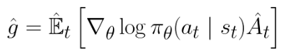
pi_theta - Neural network that takes states as input and outputs actions
A_t - Advantage estimate. Estimate of relative value of selected action in current state. 
- Determine whether action taken was better/worst than expected
-A_t = Discounted Rewards (Return) - Baseline Estimate (Value)
-- Return: Weighted sum of rewards currently found with gamma that changes prioritization of immediate vs. long-term rewards. This is found after the episode is over, so we know all rewards
-- Value Function: Expectation/Estimate discounted sum of rewards from this point. Variance because it's running a neural network
- If positive advantage, increase probability of choosing this action the next time; vice versa
**Trust Region Policy Optimization**
- Make sure new policy isn't too different from old policy
- Similar to normal Policy Gradient, but instead of log() divides by the old policy
- Adds KL constraint to policy objective - Stick close to region where thing works
**Proximal Policy Optimization**
*Objective Function*
- r(theta) denotes ratio of an action being taken in new vs. old policy
-- >1 if more probable, ||<1 if less probable
-- r(theta) x A_t = TRPO
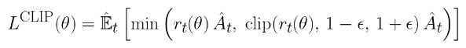
1st term = Normal policy gradients
2nd term = Clipped version of 1st term
Minimum of these two terms is expected reward
- Limit policy gradient steepness after a single estimate unless large inverse effect from what was believed before
- E.g. if action thought to be bad but was actually good, then try to reverse previous policy. Vice versa
- But if policy was good and this sample is bad, could just be noise (optimistic)
*Loss Function*
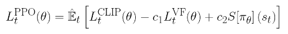
1st new term = Updates baseline network. Estimates average amount of discounted reward. Shares parameters with main PPO objective
2nd new term = Entropy term. Makes sure agent does enough exploration. Measures how unpredictable an outcome can be
Hyperparameters to weight the contributions of these two new terms
### PPO Variations
From what I could tell, though, PPO did not extend to multi-agent environments. As such, I wanted to find more information about the different PPO types when I found MARLlib, which appears to be a RL algorithm library specifically for Multi-Agent environments. In those docs, I found an explanation of the [PPO Family](https://marllib.readthedocs.io/en/latest/algorithm/ppo_family.html), which I took notes on below:
#### IPPO
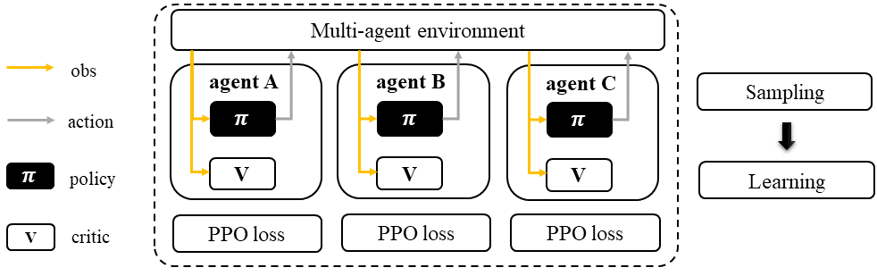
*i.e. Independent PPO*
- In IPPO, each agent has their own policy and critic, but that policy/critic model can be shared between all of the agents
- This allows for many different task types with a very similar implementation to standard PPO
- IPPO does not require information sharing, but it can be implemented if you'd like
	- **Information Sharing**: Sharing either data (obs, action, etc.), predicted data (critic value, message, etc.), or knowledge (replay buffer, model parameters, etc.)
- In IPPO, agents do not have access to the global state if they are in a partially observed setting (e.g. SAR)
#### MAPPO
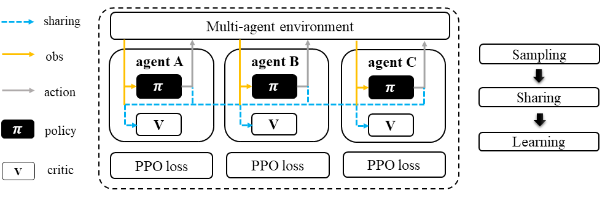
*i.e. Multi-Agent PPO*
- MAPPO is built off of IPPO, but they share observations and actions so that they can coordinate tasks
	- Example of CTDE (Centralized Training, Decentralized Execution). The agents will share data, but their actions are independently controlled by their policy.
- Inputs to centralized V function is crucial because it controls the DE of the agents
- MAPPO can be conducted in parallel (since parameters are share across agents), making it similar in speed to off-policy algorithms with enough parallelization
# 07-09-26
Today, I worked on debugging the PPO and adjusting the rewards so that the agents would complete the goals in the manner I expected.
## SAR Levels
After conducting my literature review (specifically [this](https://github.com/elte-collective-intelligence/student-search#abstract) GitHub repository), I decided that it would be a good idea to add levels to my environments. This way, I could more easily test the PPO algorithm without jumping straight into the super complex task, which will probably take longer to train as well. In the end, I made four levels, each with two agents:
- Level 0: Only surface casualties (N=`agent_num`). This is what I am using for testing the PPO, rewards, etc.
- Level 1: Half surface casualties, half entrapped casualties. I want to see whether providing rewards for going into buildings is good or not, so this is a good start
- Level 2: Same as L1, but with walls (N=5). This will allow me to tune how navigation works to encourage exploration but balance exploitation
- Level 3: Same as L2, but with more walls (N=20). This is the same as the original task I had created; I just had to work backwards to make it. \
I included most of the setup in Level 0 (e.g. instance variables, `psuedo_occluded` observations), which made the subsequent levels (which inherited the previous level) easier to program. \
Since I had changed how the SAR tasks were created, I had to change how it was redirected in `task_utils.py`:
```python
if 'SAR' in task_id:
	task_num = re.search(r'LTL(\d)', task_id).group(1)
	class_name = f'MultiGoalSAR{task_num}'
```
Once I did that, I could initialize multiple tasks in the `__init__.py` file where the other environments are initialized:
```python
multi_goal_tasks = {
	# ...
	'LTL0MASAR2': {'agent_num': 2},
    'LTL1MASAR2': {'agent_num': 2},
    'LTL2MASAR2': {'agent_num': 2},
    'LTL3MASAR2': {'agent_num': 2},
    'LTL3MASAR5': {'agent_num': 5}, # == 'LTLMASAR5'
}
```
Since I had also gotten rid of the entrapped casualties in L0, I had to put the part of the code that dealt with zeroing the `entrapped_casualtys_lidar_{i}` in a try-except block.
### More Env Scripts
Between the PPO environments, the testing environments, and the debug environment, there were now too much going on inside `test_env.py`. So, I added `debug_env.py` and `ppo_env.py` for their eponymic environments. I also reverted my changes to the testing environment so it is back to just testing the legitimacy of the custom and native environments. \
More environment scripts, though, meant that there were some methods that were being duplicated between them, most notably the `make_env()`, which I standardized into a `utils\env_utils.py` file that could be accessed by any new environment I made.
## SAR Task Integration
Because SB takes in different types for its actions and observations than Gym, I had to manipulate the spaces so that they were compatible with both. I controlled this manipulation with a new parameter `sb3=False`.
### Action Space
The first error I was receiving was in regards to the submitted action space to the PPO model. According to its [documentation](https://stable-baselines3.readthedocs.io/en/master/modules/ppo.html#can-i-use), the action space cannot be a Dict, which is what the Gym API outputs natively (since each agent has an entry). So, I had to create two methods: one that submits the action space as a Box if SB3 if active (`if callable(act_space): act_space = Box(low=-1.0, high=1.0, shape=(self.num_agents*self.action_dim,)))`) and another one to transform the SB3 input into a dictionary:
```python
def dictify_action(self, action) -> dict:
	actions = {
		f"agent_{i}": action[i * self.action_dim:(i + 1) * self.action_dim]
		for i in range(self.num_agents)
	}
	return actions
```
Once that worked, I moved on to formatting the observation space as expected by the model. *Note: This does mean that it controls both agents simultaneously using the same models rather than two independent models i.e. IPPO. Zijian recommended this so that we could test the PPO env.*
### Observation Space
The observation space wasn't as difficult to manipulate because it had already been flattened when it was submitted to Gym, which worked with SB3. However, the space it returned was not the same as the one it claimed (again, because `num_agents>1` and it would make a dict for each of them). Therefore, I had to make a method to flatten the observation so that it wasn't a nested dict:
```python
def flatten_obs(self, obs):
	flat = {
		k: v
		for agent_obs in obs.values()
		for k, v in agent_obs.items()
	}
	return flat
```
and return it to the model if SB3 is enabled.
### Reward, Terminated, Truncated Flattening
The first time I ran it though, even with 1000 timesteps, it was taking 20+ minutes. The output was also not good: the model still seemed to be moving completely randomly. After looking into the code, I saw that the `terminated` and `truncated` values were dictionaries with the values, which would automatically return `True` every step of the episode. This didn't impact `debug_env.py` since it was running the MA-compatible Gym API, but it meant that I had to `any(list(Dict.values()))` for both of them. \
In a similar vein, the rewards were in a Dict object, which isn't compatible with what PPO believes is a single agent environment. I just summed the rewards to get one "big" reward, but I might see what happens if I average them instead (TBD).
## PPO Reward Engineering
There was a lot of tweaking I did to get a model I was ~`70%`happy with, so I'm going to summarize what I did:
- Eliminated the `lidar_conf.max_dist` by setting it to `None`, so that the agents could observe more of the environment.
- Made finding the casualties a one-time reward rather than a continuous one. When thinking about the task, that does make sense as well, since staying next to a casualty doesn't make them any better.
- Made the environment walls collidable and removed the termination when they were hit (but kept the penalty)
- Increased the damping force of the joints in the `point` so that it's less slippery. It might be placebo, but I think it's easier to control and I saw better results afterwards.
	```python
		# Old = 0.005
      <joint type="slide" axis="1 0 0" name="x" damping="0.0075"/>
      <joint type="slide" axis="0 1 0" name="y" damping="0.0075"/>
	```
- Removed gremlin cost check at reset--since they haven't moved yet, it would return errors if they were too close to the agent(s)
- Changed rewards to be within `[-1, 1]` because according to information online, it's better for PPO algorithms. Current rewards:
```python
    _reward_find_casualty = 1.0
    _reward_agent_collision = -0.05
    _reward_casualty_scalar = 0.0 # * 1000 = 1.0 == _reward_find_casualty
    _reward_wall_collision = -0.5
```
- Implemented but ultimately did not run dense rewards using lidar observations to encourage the agent to move closer to the casualty. Because the reward from this trickle was more than the reward of the casualty over 1000 timesteps
- Added vectorized environment creation to `env_utils.py` to reduce training time from ~28 min to ~20 min
- Added logging of models and training logs so that models can be replayed and training can be compared over time, respectively. I also have a f-string making the model path so that models will be saved according to the environment they were trained in
- Changed evaluation episodes to 10 (more for myself)-can more easily diagnose potential issues.
# 07-10-26
Today, I struggled a lot with the implementation of PPO into the current multi-agent environment. I tried multiple different techniques to try to improve the model, but by the end of the day, I had gotten to the same place I had started with.
## Lower Rollout Sample Steps
Before, I had the number of steps at `2048`, but I realized that since I was running 8 environments in parallel, I needed that number to be `2048//8 # == 256` so that the sample size would be the same as it was with one environment.  
## casualty_lidar_ids
After talking with Zijian, he pointed out that even though I was giving the agents the lidar observations for each of the casualties, it was returning the *category* of the object rather than the actual object. As such, when implementing LTL or separate goals in the future, the agent would have to simply guess and check to find its target, which wouldn't make sense in the current setup. Therefore, he suggested that there could be an additional observation that is returned that provides the agent with the ID numbers of the casualties it can see. That way, the agent can make a more informed decision in the future, when they have to go towards a specific casualty. So, this was what I spent the majority of the day doing. \
The first thing I wanted to do was create an optional property that would allow certain geoms to be "ID'd," which in my case was `is_lidar_ids_observed`. Once I did that, then I could edit the existing `_obs_lidar_pseudo_occluded_new()` method to include the new property. Regardless of the whether or not the ids are observed, I create two observations: one for the lidar values and one for the ids. The IDs are passed into the method, and if one of the values is updated in the value observation, the associated ID will be inputted into the IDs observation. All ids are initially `-1` since that will never be a valid ID and serves as a replacement for the `0.` placeholder that is generated from `np.zeroes()`
```python
if value > vals[b]:
	vals[b] = value
	if ids is not None and instance_id is not None:
		ids[b] = instance_id
```
Once everything is collected, then the return method checks `if return_ids` and returns both the vals and the ids, otherwise it will juts return the vals. This way, the same method can be used for both ID'd and non-ID'd obstacles without significant code changes. \
```python
#With lidar IDs
lidar, lidar_ids = self._obs_lidar_pseudo_occluded_new(
	i, obstacle, return_ids=True,
)
# Without lidar IDs
lidar = self._obs_lidar_pseudo_occluded_new(
	i, obstacle, return_ids=False,
)
```
Now, the agent knows the distance and ID of each of the objects:
```sh
vals = [0.31194658 0.07665562 0.         0.         0.         0.
 0.         0.         0.         0.         0.         0.
 1.         0.         0.06644159 0.23529096]
ids = [ 1  1 -1 -1 -1 -1 -1 -1 -1 -1 -1 -1 -1 -1  0  1]
```
## Rewards Revisions and Reversions
In an attempt to make the PPO algorithm more robust, I started researching what I might need to change to my observation space or reward function so that it would work well with the advantages of PPO. For instance, although Zijian recommended purely sparse rewards, I learned that denser rewards are better for PPO because in order to create a good critic function, the agent needs to receive feedback more often to choose whether action X was more advantageous than action Y. With sparse rewards, too many of the episodes return 0, which makes the critic function quite inaccurate. \
### Idea A - Lidar-Scaled Dense Rewards
The first and easiest idea I had was to multiply the max of the lidar values by some scalar so that I could weight it relative to the original function. However, I found that the agent would "hack" this policy by circling around the casualty rather than collecting it. This was also partly because there was no `goal_achieved()` return, so if I implemented a "decay" punishment for staying alive, it would affect all runs equally regardless of the action taken.
### Idea B - Approach Reward
Once I saw that reward hacking, then I thought about what would actually be a good reward on the way to finding the casualties. I realized that, to combat reward hacking, I can calculate the difference between the current and previous lidar maximum value. In essence, I'm calculating the "velocity" relative to the "origin" of the casualty. This prevents circling since that delta would be zero because the radius isn't changing. It also benefits PPO more by providing a "slope field" that helps guide the agent towards the casualty.
## Weekly Status Report
On request from Dr. Li, James and I made status reports describing the activities we have done, our goals, and the challenges we're facing. The slides are reproduced below:
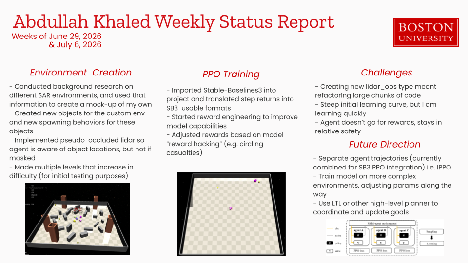
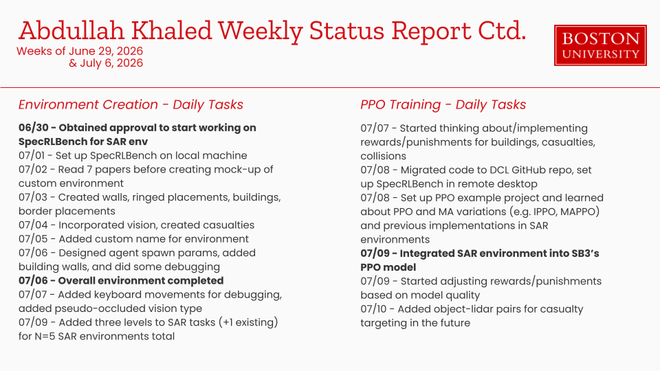
## EOD
By the end of the day, though, the PPO algorithm was behaving very similarly to how it was initially, and I didn't see much improvement in performance. I wanted to make it work with one agent by the end of the weekend.
# 07-11-26

# 07-12-26
Today, I was set on making the PPO algorithm work, at least with a single agent. I was able to get it to work:
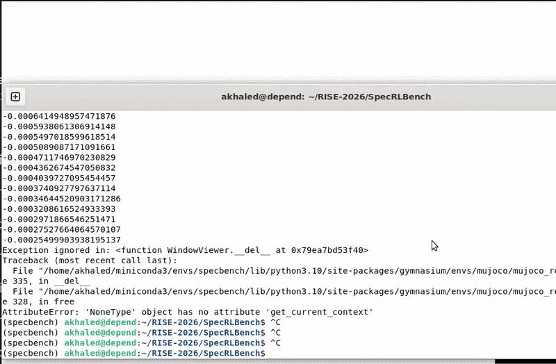 
[https://youtu.be/In8nVy22jt8](https://youtu.be/In8nVy22jt8)
# 07-13-26
Since I made a lot of changes in order to get this to work and by the time it worked, I was extremely tired, I will be attempting to summarize them below. I also ran tests and variations on some of the parameters to see what would happen and document them.
## Faster Layout Resampling
Whenever I was training the model, I found that every time it had to reset, it was taking an unusually long amount of time. According to the progress bar provided by the SB3 API, it was running 9 iterations per second, which (across 500k steps) was projected to take 88 hours, which was just not feasible. \
Looking through the code, it appeared that the entire world was being regenerated every time a new episode started, which was not necessary: the majority of the components were carried over between runs, and all that needed to be changed was the locations of the obstacles/agents to prevent overfitting. With this new `_fast_resample_layout()` method, I can simply regenerate the poses of the different objects in the environment without rebuilding their entire files from zero. Now, the ETA is ~3-4 minutes, which is ~`80%`faster than it was even when doing full `len=1000` episodes. \
As part of this as well, I switched from the default `DummyVecEnv` to a `SubprocVecEnv` because it is the [default](https://stable-baselines3.readthedocs.io/en/master/guide/vec_envs.html#subprocvecenv) for complex environments that the user wants to run in parallel.
## Per-Agent Tracking Cameras
In `SpecRLBench/specbench/envs/zones/safety-gymnasium/safety_gymnasium/tasks/safe_multi_agent/world.py`, there was hardcoded multi-agent camera creation that only worked if there was agent 0 and agent 1. I changed it so how other parts of the multi_agent workspace function such that the number of new cameras is based on `self._agent.agent_num`. 
## Separate Train/Load Scripts
I was quite annoyed with having to comment out parts of the code to have training and loading work in the same script, so I just split them into individual scripts, which made it a lot easier to work on the training portion.
## Hyperparameter Changes
[RL Baselines3 Zoo - Potentially Simplify Training Process](https://rl-baselines3-zoo.readthedocs.io/en/master/) - [GitHub Repo](https://github.com/DLR-RM/rl-baselines3-zoo/tree/master)
There were quite a few hyperparameters that I changed to improve model performance. A snippet of the final model creation code is shown below:
```python
model = PPO(
	"MultiInputPolicy",
	env,
	verbose=1,
	learning_rate=1e-4,
	n_steps=512,
	batch_size=256,
	n_epochs=10, # default
	ent_coef=0.01,
	target_kl=0.02,
	device=device, # default cuda:1
	tensorboard_log=TRAINING_LOG_PATH,
	seed=seed
	)
```
1. `learning_rate`: By default, the learning rate is `3e-4`. However, I found that the model was settling into a local minimum (i.e. circling around the goal), so I changed it to above.
2. `n_steps`: Initially `2048//8=256`, I doubled the value because it appeared that the model was still moving somewhat randomly (e.g. running into walls) with the initial value, so by increasing this value, the agent had more information with which they could work with when updating the policy. 512 is also about the same amount of time as the `max_episode_steps` was initially (has seen been increased in preparation for more complex environments), so I believe that before, 256 was simply not enough time for the agent to make meaningful progress toward the goal without it being driven in large part from entropy.
3. `batch_size`: With a larger batch size than the default (64), policy updates are much smoother, which in complex environments is important. Especially since I plan to make much more complex environments in the future, starting off using a large minibatch size seemed useful.
4. `ent_coef`: Originally 0, increasing the entropy coefficient prevents the model from collapsing too quickly, which I continuously found was a problem in my previous PPO iterations. 
5. `target_kl`: Default `None`, by limiting the KL divergence of the model I could prevent large updates from occurring in the model, which in turn prevented the "cliffs" I was seeing in my earlier runs.
6. `seed`: Honestly, I am surprised at how much of an effect setting the seed has on the policy. Initially, I had left this blank so that the agent would train on a variety of different scenarios. However, the agent kept just circling around. I believed this was because all of the variety would cause it to shoot for a local optimum rather than find better policies through exploration. Once I set the seed, the model performed a lot better than before.
## Reward Logic Migration
Based on the reference of other tasks created by Safety-Gym, I migrated all of the reward calculations to the `calculate_reward()` method of the `multi_goal_sar_0` task. For now, it just has the casualty reward calculations, but in the future I plan to use the buildings and other additional rewards to shape the agents' policy. \ 
I've also normalized the rewards so that PPO doesn't overreact in its policy changes, since from what I've seen online, PPO likes rewards to be in the domain `[0, 1]` for it to work as effectively as possible. \
I also messed with the scalar for `reward_distance`, which produced the following results:
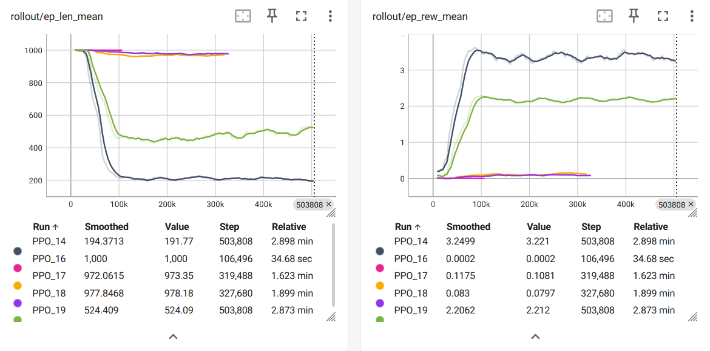
### Side-Note: Tensorboard Graphing
In order to get TB to work, you first have to include `tensorboard_log=TRAINING_LOG_PATH` in the model. If you are using the setup that I'm using,
```python
TRAINING_LOG_PATH = f"./_training_logs/ppo_{env_name}_tensorboard/"
```
Once you have that, then in a different terminal from the one you are using for training the model you can run
```shell
tensorboard --logdir SpecRLBench/TRAINING_LOG_PATH/ # Make sure to put in the acutal path, not 'TRAINING_LOG_PATH'
```
And it will be put to http://localhost:6006/. You can open it in your browser, and it'll display the information present in the terminal
<details>
<summary>I.e.</summary><code>
-----------------------------------------<br>
| rollout/                |             |<br>
|    ep_len_mean          | 1.51e+03    |<br>
|    ep_rew_mean          | 2.3         |<br>
| time/                   |             |<br>
|    fps                  | 2341        |<br>
|    iterations           | 62          |<br>
|    time_elapsed         | 216         |<br>
|    total_timesteps      | 507904      |<br>
| train/                  |             |<br>
|    approx_kl            | 0.030352127 |<br>
|    clip_fraction        | 0.344       |<br>
|    clip_range           | 0.2         |<br>
|    entropy_loss         | -2.85       |<br>
|    explained_variance   | 0.862       |<br>
|    learning_rate        | 0.0001      |<br>
|    loss                 | -0.0111     |<br>
|    n_updates            | 238         |<br>
|    policy_gradient_loss | 0.014       |<br>
|    std                  | 1.01        |
|    value_loss           | 0.00692     |<br>
-----------------------------------------</code>
</details>
As graphs, and you can compare them over time (like I did)!
## Goal Achieved Logic
In the original environment, there was no "goal" that terminated the environment: This meant that a) I couldn't do a "time-alive decay" because it would punish all runs equally, which in turn b) made circling a viable policy. When I was reading the values tested the decay, it seemed as though it performed worse than the original non-decayed function:
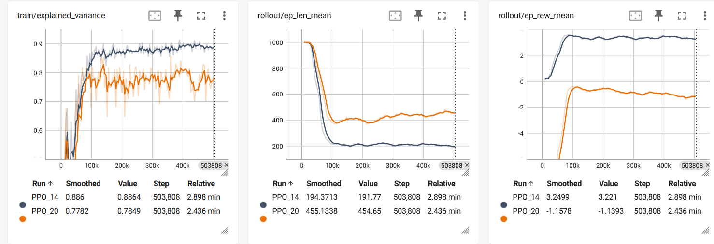
And, when testing, I found that despite the fact that it was supposed to work *better*, it actually worked *worse*, and even stayed in the same place at times (which was super confusing, since it was actively punished for that). \
To create the goal logic, I look through all of the casualties and see if they're all rescued, and if so, then return `True` for all agents. This design choice was made because the SAR environment is inherently collaborative, and if all of the casualties aren't rescued, then the task cannot be considered complete.

# 07-14-26
Today, I was trying to get the single agent surface casualties environment to work with a high success rate (>>85%), which I succeeded at with an extremely lucky seed. However, in order to even get to that point, there were many changes I made to improve both the model's hyperparameters and the evaluation  
## Evaluation Changes
### Evaluation Metrics
At the beginning of the day, my evaluation metrics weren't very descriptive. All that was there was the mean reward, which doesn't tell me anything about the different variations that could present itself during the evaluation. \
So, I captured average episode length, rescue rate, and rescue rates for when casualty was initially visible or not. This was much better for evaluations because it allowed me to understand whether it was the environment that was at fault or an issue with how my model was being trained. E.g. if there was a `50%`success rate but `100%`of times that it could see the casualty it rescued it, then the issue isn't the model but the environment.
### Reproducibility
Whenever I was seeing different results for training even when none of my hyperparameters had changed, Zijian mentioned that this was likely because there was randomization that I wasn't controlling through my seed. \
To fix this, I had to adjust the `reset()` method of the wrapper. There, I had to use the following code:
```python
if seed is not None:
	self._layout_seed = seed
elif hasattr(self, "_layout_seed"):
	self._layout_seed += 1
	seed = self._layout_seed
obs, info = super().reset(seed=seed, options=options)
info['propositions'] = []
info['casualty_visible'] = False
self.prev_casualty_visible = False
```
Essentially, this code increments the seed every run so that each individuals environment sees a new environment every run, but there is also a large amount of overlap between environment training. I had tested `+=0`, which led to large amounts of overfitting, and `+=8`, which didn't actually change the model significantly. \
Now that I had this, I was finally able to replicate the results of training exactly. Below is a screenshot from halfway through the training because otherwise, you wouldn't be able to see the difference between the two runs! 
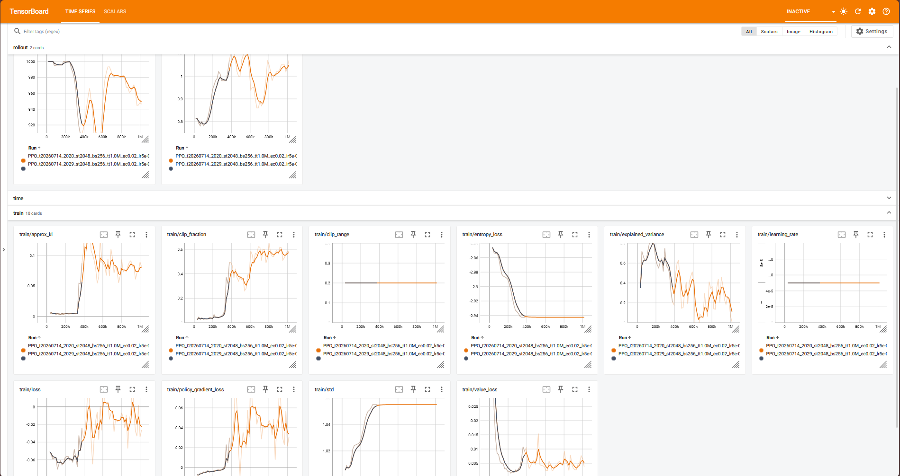
### Miscellaneous
- Increased episodes from 20 to 50 so that sample size was much larger. Other changes I made today made that much more feasible.
- Added progress bar using `tqdm` so that I know when evaluation runs are over. Very helpful when I was seedhunting and wanted to minimize logging.
- Defaulted device to `cuda:1` to prevent memory sharing with James' VLLM. This was giving me a lot of trouble with speed (see Training Changes) but since it also impacted evaluation, I changed it here.
- Reduced wall count from 20 to 10 since I was seeing negligible progress with the former 
## Training Changes
### Hyperparameter Configurability
I added many different parameters that can be changed:
- `ent_coef` - Doubled this value from 0.01 to 0.02 since the model was not exploring enough. In a sparse-reward environment, it is very important to continue exploring and additionally important since PPO needs rewards to improve its critic
- `learning_rate` - Decreased from `1e-4` to `5e-5` to balance between learning fast and exploring before exploiting. This was important for the sparse env since majority of episodes would end without any reward
- `n_steps` - `n_steps>>max_episode_length`; I changed to 2048 since `max_episode_length` was 1000
- `batch_size` - I kept at `256` because other values were worse. Batch size smooths out the gradient, which creates a difficult balance for this env so that a bad sample doesn't impact the results too much but not be drowned out in a sea of 0-reward episodes
- `n_epochs` - Decreasing the epochs can help prevent noise overfitting, but I kept at 10 because reducing it was causing the policy to be too noisy
- `clip_range` - Tried adjusting this value, but I found that the policy wouldn't update otherwise
- `target_kl` - Tried changing `target_kl` as well, but ultimately kept it at 0.03 because that was working the best \
- `visibility_reward` - Not actually a hyperparameter, but I was testing with and without the additional sparse reward of casualty visibility to incentivize searching to even see the casualty \ 
In total, I trained 56 models with varying parameters and success rates:
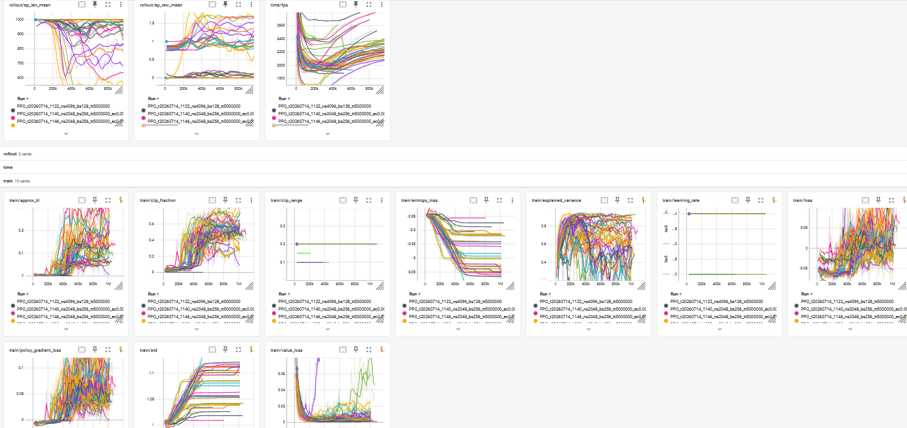 \
However, after improving the reproducibility, I was unable to reproduce the results of the `98%`successful trial. On average, I was getting ~`50%`success, which wasn't horrible but also wasn't great. Below is a video (click the image) of that `98%`successful policy:
[](https://youtu.be/UufbdYSWAVE)
<details>
<summary>Raw Notes</summary>
Sparse reward likelihood directly correlated with complexity of environment
 - Reward engineering dense rewards more complex as environment complexity increases
`policy_updates = 100 less than TOTAL_TIMESTEPS//(n_steps * n_envs)} less than 1000`
`n_steps>>max_episode_length`
Larger `batch_size`, less noisy gradient
1. Run training multiple times with visibility reward (sanity check for consistency in randomness between runs; curve should be identical)
2. Fix randomness changes [optional]

3. Run without visibility reward 3 x
4. Run with different seeds N x
[Training Evaluation Results (outputs from ppo_load_env.py)](sb3_training_eval_results.md)
</details>

# 07-15-26
## Entrapped Casualties Pivot
Once I showed these results to Zijian, he recommended that I switch from a partially observed environment to a fully observed environment. Since I didn't want to compromise the SAR environment, I was able to pivot to entrapped casualties rather than surface casualties. Since the buildings are visible above the agent's line of sight (unlike the surface casualties), it would make sense that it has the lidar estimate of where it is. Moreover, this aligns more closely with the [literature](#Papers) because more than one paper has suggested the use of UAV-UGV collaboration, where UAVs map out the environment while UGVs actually interact with the environment (UAVs == drones, so can't interact much). I first had to switch the task so that it incorporated `entrapped_casualtys` in addition to `surface_casualtys`, as well as debug a bunch of issues with the buildings.
### Building Randomization
There were multiple issues with the randomization of the buildings and the building code in general. First off, the building would spawn in the same place every run, which I assumed would make the model overfit to that data. Moreover, I couldn't spawn more than one building at the same time, and the code made it difficult to work with and debug and I had a lot of issues trying to just get two buildings in the scene. Additionally, coordinating spawning the buildings, walls, and casualties was extremely difficult since I had to set their positions and rotations in different parts of the environment creation. Because this code was so complicated, I had AI help me with this portion. \
However, what surprised me was that the model that was trained with only one building location was able to adapt to different building locations around the map, with `98%`accuracy! I will look into what caused this, but I am guessing that because there was enough randomization of the rest of the environment, the agent learning how to pathfind instead of just "go to this position" every time, which is really cool to see (image clickable):
[](https://youtu.be/R8GvCAOcREs)
## Wall Collision Punishment
Once I showed that the model could work with buildings, Zijian recommended me to punish the agent for colliding with any of the walls. This was a lot simpler to implement than the building code, because I had references from other geoms (e.g. gremlins, casualties) and the fact that the contact property is tracked by MuJoCo. Using the reward gates I've implemented for the visibility and entering buildings, I prevented punishments from recurring until the agent stops touching the wall. \
Compared to the raw performance, this one was slightly worse, at `80%`success, but considering I only trained one model on this new environment, I was quite happy with it! I hope to continue shaping this reward so that it's less extreme (it's not nearly as sparse as the final reward, so it should be treated as such).
## Code Testing
I asked AI to create tests for the code so that if changes are made, I can check what issues there are and debug them more easily using:
```bash
cd SpecBenchRL
python -m pytest specbench/envs/zones/safety-gymnasium/tests/test_specrlbench_sar_contracts.py -q
```
## Next Steps
- Spawn in multiple buildings and have the agent explore both of them to find an entrapped casualty (1/N chance of spawning) >> Might need to increase `max_episode length`
- Improve wall collision model performance while minimizing wall hits.

<details>
<summary>Raw Notes</summary>
- Provide estimated position of agent (e.g. zone) as part of observation space
- Give reward for entering that zone
- Give reward for finding casualty
---
- cost for collisions to walls or terminate (test)
- surface casualties 
- multiple buildings, some have casualties
</details>

# 07-16-26
## Meeting with Dr. Li
- Reward machines/state machines with rewards
- PPO with Safety/Reachability constraints
- **Exploration-driven heuristics or intrinsic reward >> Small ++ when new observation seen**
## Intrinsic Rewards
One of the most interesting ideas Dr. Li proposed to me was the intrinsic rewards. For much of the training process, I had noticed that the model often would not "take the long way" if it faced an obstacle (e.g. a wall) in its direct path to the entrapped casualty. After reading through OpenAI's [Large-Scale Study of Curiosity-Driven Learning](https://arxiv.org/pdf/1808.04355), I was extremely interested in incorporating some type of curiosity into the model, since it seemed prevalent to the type of environment many SAR scenarios fall under. 
## Random Network Distillation
After reviewing what OpenAI had already done, I found this paper: [EXPLORATION BY RANDOM NETWORK DISTILLATION](https://arxiv.org/pdf/1810.12894) and well as its [official implementation on GitHub](https://github.com/openai/random-network-distillation). \
Random Network Distillation (RND) builds off of PPO but with an intrinsic reward for seeing new states (i.e. curiosity). However, forward-model curiosity methods can face issues because prediction error comes form multiple sources:
1. Epistemic Uncertainty - This is when the model finds a new state it hasn't seen before. This is usually what "curiosity" means from an intuitive sense--new information == more intrinsic/curious reward
2. Stochasticity / Aleatoric Uncertainty - When an agent finds something that is not deterministic,. This interferes with forward-model curiosities because of something called "the noisy TV problem." Basically, if an agent finds a TV with static noise, because each state will have a new noise pattern, it will have high curiosity for the TV.
3. Model Misspecification - The predictor model is unable to accurately represent the target network. For example, if the target is a non-linear function while the predictor is a linear function, it will never be able to fully predit the target and, therefore, will always have aprediction error >>0
4. Learning Dynamics - The predictor cannot find an accurate prediction model for the target function. Most often, if factors 1-3 are satisified, this is due to incorrect hyperparameters

> RND obviates factors 2 and 3 since the target network can be chosen to be deterministic and inside the model-class of the predictor network (Burda et al. 2018)

Therefore, the only factors that could influence RND's intrinsic reward are factors 1 (good) and 4 (can be adjusted). In practice, the researchers found that RND operated better than any other algorithm previously tested on the environment, and found better results when the agent explored non-episodic settings (i.e. no truncation). It may be worth trying to increase the episode length of the SAR environments to further incentivize exploration, since currently they are loosely tailored to the task.
### SB3 Integration
After reading through the paper, I wanted to start implementing it into the existing SB3 architecture I had settled on for the project. However, the implementation OpenAI went with was based on the impl of Schulman et al. (2017), which was different from how SB3 received observation and reward spaces. So, I had to subclass the existing SB3 PPO implementation and add onto it an RND module that introduced the intrinsic reward for curiosity. \
Empirically, RND seemed to work better than PPO, with success rates in the `90-100%`percentile range for the SASC with Obstacles, SAEC, and SAEC with Distractor environments. However, this was only after I added additional logic that helped the agent ignore buildings that had no entrapped casualty.
## Building Reward Hacking
Even though I was seeing RND improving the policy, there was something in common with all of these policies that I wanted to fix. After entering a building, the agent would repeatedly enter and exit that same building. There were multiple ways I tried to fix this, which I will lay out below:
### Punishment for Re-Entry
Since PPO does not take into consideration costs, the only way to influence its policy is through the reward it receives. So, the most simple idea I could think of was to have a negative reward that scales as the agent tries multiple times to enter the same building. I could gate the detection system using the same method I used for the `self.prev_casualty_visible` parameter I used [earlier](#07-14-26). Instead, though, each time the variable was triggered, a `cost_multiplier` would decrease by `1/num`. E.g. with `num=2`, the reward for entering a building becomes
$$  0.5 \rightarrow 0.0 \rightarrow -0.5 \rightarrow -1.0 \rightarrow ... \rightarrow -\infty$$
One thing I forgot when making this, though, was that PPO does not work well with non-normalized rewards. In other words, the negative punishments were likely harming the model instead of helping it, which was reflected in the performance differences (none) in this new model
### Ignore Inside Building
The next method I tried was to ignore the building while it was inside. Based on what the policy believed was optimal, I could assume that it was just going to wherever the highest building lidar was located. Because of this assumption, I believed that if I made the building lidar disappear, then it would hone in on the further building. \
This worked until the agent left the building again. Once that happened, then it would see the building it had previously entered and return to the original building. In hindsight, this was a pretty easy behavior to predict, but it helped me settle on my final strategy for the building environment.
### Ignore Building After Entry
In the end, I made it so that once the agent entered a building, that building's lidar was "turned off" for all agents (for future MAS envs), essentially marking it as "explored." Once I did this, the next run that I did for the environment resulted in `46/50 (92.0%)` success rate, which was awesome to see! Attached below is a video of that run. In my opinion, it is really cool to see how the agent navigates the walls to search one building after another.
[](https://youtu.be/EWgiY4UBIAI) 

# 07-17-26

## Wall Collision Detection
Now that I had a working policy for the four environments I wanted to use (for now) (SASC, SASC-Obstacle, SAEC-Obstacle, SAEC-Obstacle-Distractor), Zijian recommended that I try to emphasize safe RL using wall collisions as the first step. Once the agent can account for costs as a result of constraints,  I hope to incorporate multi-agent systems because the agent must be able to avoid multiple potential costs simultaneously for a MAS to work. \
The first type of wall collision I tried was direct collision with the agent. Luckily, MuJoCo comes with a contact property that lets you see if objA has contacted objB, which I was able to use for this purpose. However, when I tested it in my debug environment, I found out that the "Point" agent body only accounts for the sphere and not the camera rectangle that is attached. This means that the agent would often not realize that it was colliding with the wall and continue trying to phase through the wall, where it knew the building was on the other side. \
After seeing this, I then tried to use the gremlin MoCap with a similar utilization (i.e. the contact property). This worked a lot better after resizing and adjusting the position of the gremlin relative to the agent until it was at a place that I was satisfied with. \
I ran all PPO and RND to see how they performed, and both did not do good. Normal PPO had a `66%`success rate with the SAEC-Obstacle env and a `0%`success rate with the SAEC-OD env. While RND had a `66%`and `44%`success rates, respectively. Seeing this, I knew that I needed a different algorithm that took into account the costs of its actions.
## Safety Constraints
So, I asked Zijian for recommendations as to what I could use, and here is what he suggested: 
- Lagrangian PPO
	- MinMax policy with lagrangian
	- OmniSafe (X)
- CBF - Control Barrier Function
	- Model cost using CBF
- Hamilton-Jacobian Reachability Analysis
	- Model safety constraints >> Maximize reward such that cost is below threshold N
He told me to go with PPO Lagrangian because it was the simplest to implement (relatively). Luckily, OpenAI already implemented PPO Lagrangian as part of their paper [Benchmarking Safe Exploration in Deep Reinforcement Learning](cdn.openai.com/safexp-short.pdf), where they introduce Safety-Gym as well. Using that information, I was able to ask AI to make an implementation that works directly with Stable-Baselines-3. Once I did that, I tested it on the SAEC-Obstacle environment and achieved `72%`accuracy. I was definitely more pleased with that result, so I set out to try 
```sh
Traceback (most recent call last):
  File "/home/akhaled/RISE-2026/SpecRLBench/debug_env.py", line 24, in <module>
    obs, reward, terminated, truncated, info = env.step(action)
ValueError: too many values to unpack (expected 5)
```
Means that environment not set with safety wrapper.

# 07-18-26
# 07-19-26
# 07-20-26
Look into more papers and see if their method can be used to train in current environment
- CPO, PPO-Lagrangian, SAC-Lagrangian, TRPO-Lagrangian
	- [Safety Starter Agents](https://github.com/openai/safety-starter-agents/tree/master) (!!)

# 07-21-26
```sh
tmux
cd SpecRLBench/; conda activate specbench; export DISPLAY=":10"; python train/{ALGO}_train_env.py
```

## Safe PO Migration
```sh
cd ~/RISE-2026/SpecRLBench && python train/ppo_lag_train_env.py --task PointLTL4MASAR1WC-v0 --seed 0 --total-steps 1000000 --num-envs 8 --steps-per-epoch 16384 --device cuda --device-id 1 --write-terminal True --use-tensorboard True
```

--- 
#project/idea 