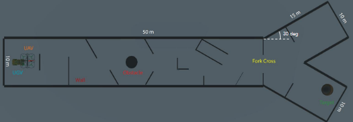
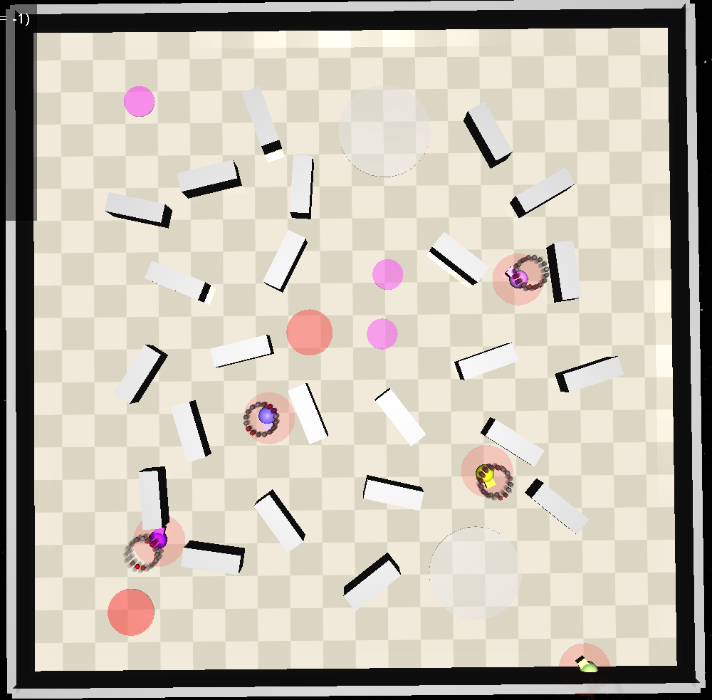
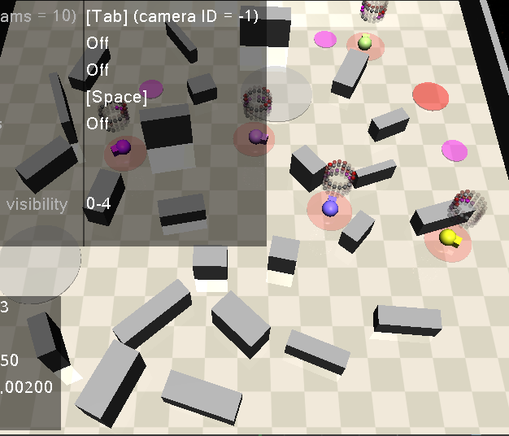

---
aliases:
  - <%tp.file.cursor()%>
subset: []
Created:
  - <% tp.file.include("[[templates/timestamp note]]") %>
worksIn: []
for: []
isA: []
by:
  - "[[Abdullah Khaled]]"
at: []
hasTopic:
  - "[[SpecRLBench]]"
year: "[[2026]]"
with:
score:
---
<!-- Table of Contents arrowType: - | title: Table of Contents  | codeBlocks: y -->
# Table of Contents
- [[_devlog#Sources|Sources]]
- [[_devlog#Papers|Papers]]
- [[_devlog#06.29.2026|06.29.2026]]
	- [[_devlog##Old Command|Old Command]]
	- [[_devlog##New Command|New Command]]
- [[_devlog#06.30.2026|06.30.2026]]
	- [[_devlog##Issues & Solutions|Issues & Solutions]]
	- [[_devlog##New Understandings|New Understandings]]
- [[_devlog#07.01.26|07.01.26]]
	- [[_devlog##Instructions for SpecRLBench Dev|Instructions for SpecRLBench Dev]]
	- [[_devlog##Setting up SpecRLBench|Setting up SpecRLBench]]
- [[_devlog#07.02.26|07.02.26]]
	- [[_devlog##07.02.06 Papers|07.02.06 Papers]]
			- [[_devlog####[Unmanned Ground Robots for Rescue Tasks](https://www.intechopen.com/chapters/56080)|[Unmanned Ground Robots for Rescue Tasks](https://www.intechopen.com/chapters/56080)]]
			- [[_devlog####[UAV-UGV Cooperative Trajectory Optimization and Task Allocation for Medical Rescue Tasks in Post-Disaster Environments](https://arxiv.org/pdf/2506.06136)|[UAV-UGV Cooperative Trajectory Optimization and Task Allocation for Medical Rescue Tasks in Post-Disaster Environments](https://arxiv.org/pdf/2506.06136)]]
			- [[_devlog####[Target Search and Navigation in Heterogeneous Robot Systems with Deep Reinforcement Learning](https://arxiv.org/pdf/2308.00331)|[Target Search and Navigation in Heterogeneous Robot Systems with Deep Reinforcement Learning](https://arxiv.org/pdf/2308.00331)]]
			- [[_devlog####[SpecRLBench.. A Benchmark for Generalization in Specification-Guided Reinforcement Learning](https://arxiv.org/pdf/2604.24729v1)|[SpecRLBench.. A Benchmark for Generalization in Specification-Guided Reinforcement Learning](https://arxiv.org/pdf/2604.24729v1)]]
			- [[_devlog####[Search Planning of a UAV-UGV Team with Localization Uncertainty in a Subterranean Environment](https://arxiv.org/pdf/2102.06069)|[Search Planning of a UAV-UGV Team with Localization Uncertainty in a Subterranean Environment](https://arxiv.org/pdf/2102.06069)]]
			- [[_devlog####[Collaborative Multi-Robot Search and Rescue.. Planning, Coordination, Perception, and Active Vision](https://ieeexplore.ieee.org/stamp/stamp.jsp?tp=&arnumber=9220149)|[Collaborative Multi-Robot Search and Rescue.. Planning, Coordination, Perception, and Active Vision](https://ieeexplore.ieee.org/stamp/stamp.jsp?tp=&arnumber=9220149)]]
			- [[_devlog####[A Heterogeneous Unmanned Ground Vehicle and Blimp Robot Team for Search and Rescue using Data-driven Autonomy and Communication-aware Navigation](https://ieeexplore.ieee.org/stamp/stamp.jsp?arnumber=10876050)|[A Heterogeneous Unmanned Ground Vehicle and Blimp Robot Team for Search and Rescue using Data-driven Autonomy and Communication-aware Navigation](https://ieeexplore.ieee.org/stamp/stamp.jsp?arnumber=10876050)]]
		- [[_devlog###GitHub Repositories|GitHub Repositories]]
				- [[_devlog#####[akhaled247/SpecRLBench](https://github.com/akhaled247/SpecRLBench)|[akhaled247/SpecRLBench](https://github.com/akhaled247/SpecRLBench)]]
				- [[_devlog#####[akhaled247/BURISE-26](https://github.com/akhaled247/BURISE-26)|[akhaled247/BURISE-26](https://github.com/akhaled247/BURISE-26)]]
- [[_devlog#07.03.26|07.03.26]]
	- [[_devlog##Making Walls|Making Walls]]
		- [[_devlog###Initial Setup|Initial Setup]]
		- [[_devlog###Ringed Placements|Ringed Placements]]
		- [[_devlog###Random Sizing|Random Sizing]]

<!-- End of TOC -->

#rise-dcl-log 


# Sources
[ROS Ubuntu Installation](https://wiki.ros.org/noetic/Installation/Ubuntu) \
[Information Slideshow](https://docs.google.com/presentation/d/1C7Mwcdt3m7QfknjxOcZXIfugGhLVEKumrAQWOlkqRtM/edit?pli=1&slide=id.p#slide=id.p) \
[tf tutorials](https://wiki.ros.org/tf/Tutorials) \
[geometry msgs wiki](https://docs.ros.org/en/noetic/api/geometry_msgs/html/index-msg.html) \
[pubsub with python](https://wiki.ros.org/ROS/Tutorials/WritingPublisherSubscriber(python)) \
[frames](/_pages/rise/frames.pdf) \
[SpecRLBench](https://github.com/BU-DEPEND-Lab/SpecRLBench) \
[RISE Python Training](https://github.com/akhaled247/rise_python_training/tree/main) \
[Gymnasium Documentation](https://gymnasium.farama.org/tutorials)
[MuJoCo Creating Models](https://mujoco.readthedocs.io/en/latest/XMLreference.html)
[akhaled247/SpecRLBench](https://github.com/akhaled247/SpecRLBench)
[BURISE-26 Project Repository](https://github.com/akhaled247/BURISE-26)
# Papers
| URL                                                              |
| ---------------------------------------------------------------- |
| https://www.intechopen.com/chapters/56080                        |
| https://arxiv.org/pdf/2506.06136                                 |
| https://arxiv.org/pdf/2308.00331                                 |
| https://arxiv.org/pdf/2604.24729v1                               |
| https://arxiv.org/pdf/2102.06069                                 |
| https://ieeexplore.ieee.org/stamp/stamp.jsp?tp=&arnumber=9220149 |
| https://ieeexplore.ieee.org/stamp/stamp.jsp?arnumber=10876050    |
# 06.29.2026
We attempted to set up ROS Noetic on Ubuntu 20.04 within a docker container within a remote desktop. Initially, this is the command we chose:
## Old Command

```Shell
docker create \
 --name workspace \
 --gpus all \
 --net=host \
 -e DISPLAY=$DISPLAY \
 -v /tmp/.X11-unix:/tmp/.X11-unix \
 -v /home/akhaled/workspace:/home/akhaled/workspace \
 -w /home/akhaled/workspace \
 ubuntu:20.04 \
 tail -f /dev/null
```
However, since that did not work, we went with this command, that created a ROS Noetic container directly in Docker rather than having another layer of abstraction. So, we created a ROS Docker container in a remote desktop. 
## New Command

```sh
docker run -it \
  --name=ros_noetic \
  --net=host \
  --gpus all \
  -e DISPLAY=$DISPLAY \
  -e NVIDIA_DRIVER_CAPABILITIES=all \
  -v /tmp/.X11-unix:/tmp/.X11-unix:rw \
  osrf/ros:noetic-desktop-full
  
docker exec -it ros_noetic bash
```
After that, we had to install the rest of the ROS suite, which we completed using these commands. *Note: the Sawyer robot repo is years out of date, so some of the dependencies were outdated. We just tried our best with what we had and ignored the useless depends.*
```sh
apt update
apt-get install git-core python3-wstool python3-vcstools python3-rosdep ros-noetic-control-msgs ros-noetic-joystick-drivers ros-noetic-xacro ros-noetic-tf2-ros ros-noetic-rviz ros-noetic-cv-bridge ros-noetic-actionlib ros-noetic-actionlib-msgs ros-noetic-dynamic-reconfigure ros-noetic-trajectory-msgs ros-noetic-rospy-message-converter

apt install python3 python3-pip python3-venv

pip install argparse

mkdir ros_ws
cd ros_ws
mkdir src

wstool init .

apt install git
cd src
git clone https://github.com/RethinkRobotics/sawyer_robot.git
wstool merge sawyer_robot/sawyer_robot.rosinstall
wstool update
source /opt/ros/noetic/setup.bash
catkin_make

apt-get install gazebo11 ros-noetic-gazebo-ros  ros-noetic-gazebo-ros-control
ros-noetic-gazebo-ros-pkgs ros-noetic-ros-control ros-noetic-control-toolbox ros-noetic-realtime-tools
apt-get install gazebo11 ros-noetic-gazebo-ros  ros-noetic-gazebo-ros-control  ros-noetic-gazebo-ros-pkgs ros-noetic-ros-control ros-noetic-control-toolbox ros-noetic-realtime-tools  ros-noetic-ros-controllers ros-noetic-xacro python3-wstool ros-noetic-tf-conversions ros-noetic-kdl-parser

cd src

git clone https://github.com/RethinkRobotics/sawyer_simulator.git -b noetic_devel
git clone https://github.com/RethinkRobotics-opensource/sns_ik.git -b melodic-devel

rm .rosinstall
wstool init .
wstool merge sawyer_simulator/sawyer_simulator.rosinstall
wstool update

cd ..
source /opt/ros/noetic/setup.bash
catkin_make

cd src/sawyer_simulator/sawyer_gazebo/src
apt install nano
nano head_interface.cpp

cd /ros_ws/src/sawyer_simulator/sawyer_gazebo/src/head_interface.cpp line 71:
  cv_ptr->image = cv::imread(img_path, cv::IMREAD_UNCHANGED);
  
 catkin_make 
 
 cd ros_ws
 . devel/setup.bash
 roslaunch sawyer_sim_examples sawyer_pick_and_place_demo.launch
```
# 06.30.2026
We are now trying to see the simulator in the remote desktop via NoMachine. Before, we had SSHed into the remote desktop using `ssh <user>@10.210.22.197`, but since we needed the Gazebo simulation visualizer to actually understand what was happening, so we had to set up a remote desktop.
*Note: make sure you ssh out of the device before connecting with remote desktop connection
`pkill -u $USER -f Xorg`*
## Issues & Solutions
- Python 3 errors: `ln -s /usr/bin/python3 /usr/bin/python`
* Syntax error in `/root/ros_ws/src/sawyer_simulator/sawyer_sim_examples/scripts/ik_pick_and_place_demo.py`
	- Have to write `as e` instead `of , e` (three exceptions)
- We had an issue where the interpolation for the robotic arm to come down onto the block. `_servo_to_pose` was linear, which didn't work for quaternions due to unit vector math that meant that linear interpolation would make the length of the vector `!= 1`
	- Solution: we reduced the step size to 1 so that we did not have to worry about intermediate steps. since we are only working with cartesian movements, this wasn't a huge worry
- The initial block pose was inaccurate, since it was manually set by the Sawyer devs
	- We found out how to find the block pose using the Gazebo sim GUI
- The block pose was not dynamic (i.e. if the block got moved, the robot didn't know where to go)
1. Learned how `rostopic` works and found the topic that published information about the coordinates of the scene objects
	* `rostopic list`
2. Learned how to subscribe to the topic in the CLI and found the type of the message that was being published
	* `rostopic info /gazebo/model_states` >> `ModelStates`
  3. Learned about pub/sub in python (!= CLI) and how to parse the data
  4. Learned about what `tf` library does and began to implement using CLI first
  5. Then learned how to use it in code using tutorials above. also what a frame was and how to perform type manipulation (i.e. `Point` <==> `Vector3`)
  6. Had to offset the position due to unknown reasons (likely because model is somewhat inaccurate), though it might also be because of something with the simplified orientation calculations we did (*Note: Later, we found out that it was because the origin of the pose was not the center of the objects, but one of the vertices.*)
## New Understandings
* Learned more about the CLI, especially became comfortable with `nano` in Linux
* Understood `try except finally` blocks and how to handle exceptions gracefully
* Learned Python class structure through the creation of the `DataSubcriber` class
# 07.01.26
I talked with Zijian about his project and received confirmation from Dr. Li to work with Zijian on [SpecRLBench](https://github.com/BU-DEPEND-Lab/SpecRLBench), with the following instructions:
## Instructions for SpecRLBench Dev
- Try out the current SpecRLBench, getting familiar with the Gym setup
- Come up with real-world scenario-inspired examples for the multi-agent setting,
- Create the corresponding environments or modify existing environments for the examples,
- Formalize the requirements in our multi-agent spec language
- train and evaluate agents that use vision as inputs

Towards these goals, I started learning the foundational skills and frameworks that SpecRLBench is using, which I am tracking in [RISE Python Training](https://github.com/akhaled247/rise_python_training/tree/main)
As part of this training, I have learned
- Python syntax for control systems, classes, and overall how code is structured in Python
- Gymnasium: Basic setup, hyperparameters, Q-Learning, REINFORCE algorithm with Mudoco
*Note: There is more to the training, but at this point, I received the email from Dr. Li regarding what I should focus on, so I pivoted to directly working on the SpecRLBench stuff.*

## Setting up SpecRLBench
Unlike in the tutorial, I didn't have to run `cd specbench` since the install file was in the main folder  
I also had to run these commands
```bash
pip install -e .
pip install -e specbench/envs/panda-gym
pip install -e specbench/envs/zones/safety-gymnasium
```
instead of `./install.bash` because <u>a)</u> the script was `install.sh` and <u>b)</u> I would get this error:  
```bash
(specbench) C:\GitHub\rise_project\SpecRLBench>./install.sh
  '.' is not recognized as an internal or external command,
  operable program or batch file.
```
TODO: Learn how to make custom environments in gymnasium
Create custom environment
Lit review of current search-and-rescue operation environment definitions

I then started exploring more into the `safety-gymnasium` and its environments, and found the [Building Button](https://safety-gymnasium.readthedocs.io/en/latest/environments/safe_vision/building_button.html) environment, which seems to be similar to the search-and-rescue operations I am interested in. This env also incorporates vision (optional), which is something I can look into.

# 07.02.26

I started the day out by trying to understand how environments are created. A running list of classes I have found are below:
`builder.py` - this is the builder of the environments, which is where the world is constructed (inluding obstacles) \
`__init.py__` - this is where all of the environments are created when you run `pip install -e .` \
`world.py` - this is the world that includes the observation space
`\base` - this is where all of the "template" files are included
- `underlying` - the source of all of the base files
- `base_task` - the template for creating tasks
`\ltl` - the directory where all of the LTL-specific (TODO: WORDS NEEDED) are created
- `ltl_base_task` - built off of `base-task`, it allows the user to encode LTL tasks. Used by other ltl tasks in `\ltl`
- *Note: These tasks must be imported into the `__init.py__` file in the `\tasks` directory*
After exploring the repository more, I was able to create my own custom task `multi-goal-level3` and my own gym wrapper `safety_gym_wrapper_ma_sro` and integrate them into the existing codebase.
After that, I moved on to diving deeper into how simulation environments for search and rescue (SAR) environments are currently constructed. Below are all of the papers that I have analyzed so far to learn about how to make a new environment that would satisfy the goals outlined in the presentation provided. 
## 07.02.06 Papers
#### [Unmanned Ground Robots for Rescue Tasks](https://www.intechopen.com/chapters/56080)
Simulation uses a grid map, but also uses point-cloud mapping to construct a 3D visualization of the environment.
#### [UAV-UGV Cooperative Trajectory Optimization and Task Allocation for Medical Rescue Tasks in Post-Disaster Environments](https://arxiv.org/pdf/2506.06136)
Trying to create tasks for multiple agents, with each task being completed individually.
Using [[Genetic Algorithm]]s, which are better for complex environments. Selects the highest-fitness individuals and mutates them.
Each agent is assigned one task unique to them
Minimum safety distance away from vehicle
Obstacles represented as circles (zones!!!), all vehicles spawn in the same place
https://github.com/Cherry0302/disaster_uav_ugv_rescue_planner
#### [Target Search and Navigation in Heterogeneous Robot Systems with Deep Reinforcement Learning](https://arxiv.org/pdf/2308.00331)

>[!quote]
>The black lines denote the wall and the sphere-represented victim randomly appears in one of the two branches during the environment generation
#### [SpecRLBench.. A Benchmark for Generalization in Specification-Guided Reinforcement Learning](https://arxiv.org/pdf/2604.24729v1)
Benchmark for testing different spectulation-guided RL models (hence [SpecRLBench](SpecRLBench..%20A%20Benchmark%20for%20Generalization%20in%20Specification-Guided%20Reinforcement%20Learning.md) name). Currently, there are 19 environments to choose from, split between **navigation** and **manipulation** tasks. I don't understand how the environments are dynamically created, so I will have to look into that.
#### [Search Planning of a UAV-UGV Team with Localization Uncertainty in a Subterranean Environment](https://arxiv.org/pdf/2102.06069)
]
Simulation environment was more realistic (using Gazebo simulator)
- Included irregular models, but was essentially a cylinder cut in half and hollowed out
- Sensors included LIDAR and two cameras -- one facing upwards, and one facing forwards. This was done to map out the entire environment since it was a 3D space (by contrast, the [SpecRLBench](SpecRLBench..%20A%20Benchmark%20for%20Generalization%20in%20Specification-Guided%20Reinforcement%20Learning.md) workspace is effectively 2.5D)
#### [Collaborative Multi-Robot Search and Rescue.. Planning, Coordination, Perception, and Active Vision](https://ieeexplore.ieee.org/stamp/stamp.jsp?tp=&arnumber=9220149)
Simulation for SAR environments should be more robust than traditional applications since the environment is often more complex than traditional environments.
**Sim2Real** methods
Important to consider noisy data, unbalanced data, and conflicting data as potential issues when abstracting away certain parameters
- May be useful to consider creating some of these disruptions within the simulator to increase its realism

(10/27) Multi-Robot Task Allocation
- Most often these are centralized, but decentralized approaches are more robust for the types of environments they operate in (especially SAR environments)
- Market-based approaches and auctions
- Liu et al. -- Potentially use a supervised system to adapt the robot when new situations occur
#### [A Heterogeneous Unmanned Ground Vehicle and Blimp Robot Team for Search and Rescue using Data-driven Autonomy and Communication-aware Navigation](https://ieeexplore.ieee.org/stamp/stamp.jsp?arnumber=10876050)
Teams were given points based on how many "artifacts" they found and reported to the correct location (not individuals)
UAVs and UGVs worked together to a) map out the environment and b) find the aforementioned artifacts (e.g. person, backpack, items, etc.)
Real-world environments (not super helpful for understanding how simulations should be made)
UAVs (blimps) were used in mazes and trajectories were mapped out

Once I finished reading those papers, I constructed a mock-up of the environment and task that I hope to complete:

The obstacles, victims, buildings, and humans will all be randomized (easier than static placements), and the agents will always spawn near the center. This way, there is a good balance between randomness (which is required to prevent an overfitted policy) and structure (since otherwise, the simulation would not be realistic).
### GitHub Repositories
##### [akhaled247/SpecRLBench](https://github.com/akhaled247/SpecRLBench)
This is a fork of the SpecRLBench repository, where i am developing the environment as explains above.
##### [akhaled247/BURISE-26](https://github.com/akhaled247/BURISE-26)
This is the repository where I'm housing the work that I have done. Currently, it just has the SpecRLBench submodule, but I may add other directories if needed.  [TODO: Ask for recommendation/permission to move repo to BU-DEPEND-LAB] 

# 07.03.26
We have off since it's a federal holiday, but I wanted to continue working on at least the task environment so that it was easier to implement higher-level features nearing the end of my internship.
I keep getting this error,
```sh
 assert all(cost[agent]['cost_sum'] == 0 for agent in self.possible_agents), f'World has starting cost! {cost}'
AssertionError: World has starting cost! {'agent_0': {'wall_sensor': array([0.01272425, 0.23717354, 0.10691148, 0.00573575]), 'cost_ltl_walls': 0, 'cost_zones_gray': 0, 'cost_zones_magenta': 0, 'cost_zones_red': 0, 'cost_collision': 0, 'cost_sum': 0}, 'agent_1': {'wall_sensor': array([0.00435828, 0.01436281, 0.31213399, 0.09471465]), 'cost_ltl_walls': 0, 'cost_zones_gray': 0, 'cost_zones_magenta': 0, 'cost_zones_red': 1, 'cost_collision': 0, 'cost_sum': 1}, 'agent_2': {'wall_sensor': array([0.05111625, 0.11643658, 0.02661322, 0.01168334]), 'cost_ltl_walls': 0, 'cost_zones_gray': 0, 'cost_zones_magenta': 0, 'cost_zones_red': 0, 'cost_collision': 0, 'cost_sum': 0}, 'agent_3': {'wall_sensor': array([0.01516125, 0.01623947, 0.08972661, 0.08376926]), 'cost_ltl_walls': 0, 'cost_zones_gray': 0, 'cost_zones_magenta': 0, 'cost_zones_red': 0, 'cost_collision': 0, 'cost_sum': 0}, 'agent_4': {'wall_sensor': array([0.05635487, 0.38731112, 0.02413932, 0.00351234]), 'cost_ltl_walls': 0, 'cost_zones_gray': 0, 'cost_zones_magenta': 0, 'cost_zones_red': 0, 'cost_collision': 0, 'cost_sum': 0}}
```
Which, according to AI, boils down to the world being too crowded, resulting in an environment that already has costs associated with it. To combat this, I reduced the number of agents. After this, I started working on making the walls.
## Making Walls
### Initial Setup
There were multiple issues I faced while I was trying to make the walls. First, I had to learn how to make a new geom. The existing wall geom was a stub, or simply a template that did not have the necessary parameters to exist in the simulated environment. So, I took the code from the `pillars` geom as a reference for creating the walls, since they share many of the same properties. Initially, here is what I had to change:
	1. `size`: With the pillars, `size` was just a float value that represented the radius of the `cylinder`. However, for the walls, they were of `type: 'box'`. As such, I had to change this parameter to **`half_sizes`**, which was of type `list` that took in three variables, `[x, y, z]`, that represented how far from the center the wall would extend in 3D. This also meant that the position of the box in the configuration was `'pos': np.r_[xy_pos, half_sizes[-1] + 1e-5]`, where `half_sizes[-1]` was the final (z) element of the list.
	2. `type`: As mentioned previously, I had to change the type of the obstacle to `box` so that it wasn't a cylinder.
	3. `name`: The name of the geom was changed to `"walls"` since when the `pos(self)` method is called, it will return `wall_N` where N represents the index of that wall.
This allowed me to render the wall for the first time in the simulation, which was quite exciting. They had random positions, which is what I wanted, but they would intersect with the ring that I wanted to leave for the agents.
### Ringed Placements
So, I started working on making the walls spawn in a specified ring. Below were the requirements I set:
1. The ring's inner/outer radius had to be specifiable, ideally with a +-margin of error
2. The ring had to have a hollow center, such that agents could be placed within that inner ring
3. Walls had to be able to be placed randomly along that ring: I didn't want them to spawn in the same place every time
4. Wall spawning would ideally be controlled by `random_generator.py`. This way, the initial seed would be the sole determinant of the randomness, meaning that the simulation wouldn't change between runs unless the seed was changed
I first started with trying to understand how the `placements` attribute worked for geoms, which I found explained [here](https://safety-gymnasium.readthedocs.io/en/latest/components_of_environments/objects.html#general-parameters) in the safety-gym docs. I learned that placements are boxes, constrained by (x,y) coordinates from the origin, that specify a region that the object's origin can be located. Placements can either be a single 4-tuple (i.e. `(x_min, y_min, x_max, y_max)`) or they can be a 1D array of these regions (i.e. a `list`). However, there was an issue since I wanted a ring, I would have to take multiple samples along the ring radius and create boxes from them. Therefore, I had to convert the polar coordinates `(r, θ)` into `(x, y)` using trigonometry, then created a box with dimensions `2 * margin` around that central point. I used `WALL_COUNT` samples so that the walls would be approximately spaced around the ring, and forced the margin to be larger than the `keepout` (if no margin specified). That created an environment that looked like this:

### Random Sizing
However, I also wanted the sizes of the walls to be different. So, I initially created a method (taking code from the `ring_placements()` method) that allowed me to create `n` len=3 arrays that would output `[x, y, z]` so that the dimensions were random every time. That was a little *too* random, though: each run, instead of preserving the values based on the original seed, the method would return a new list of half_sizes. This was because I was using `np.random` to create the lists rather than `self.random_generator` because the latter does not initialize until after `reset()` has been called in the task.
So I changed how the random sizing was stored. Instead of a new instance of the list being created every time the `test_env.py` is run, there is a `_cached_wall_half_sizes` variable that is initially set to `None` in the class scope. Then, when the `_build()` method is called (which happens after `reset()`), `size_randomization(base_half_sizes, num, margins, random_generator=self.random_generator)` is called. This value is then cached in the task, so that when the env is run again, it loads the existing values instead. This way, for each seed `s`, the agent will see a reproducible environment, allowing the user more control over the simulation params. With those changes implemented, the following environment was generated:

As you can see, the sizes are more randomized than before, and are also much more controlled in size. Since the `point` agents cannot jump over walls, (as of now), it didn't make sense for the walls to be super high. This also improves the UX, since more of the scene is visible at a time.


--- 
#project/idea