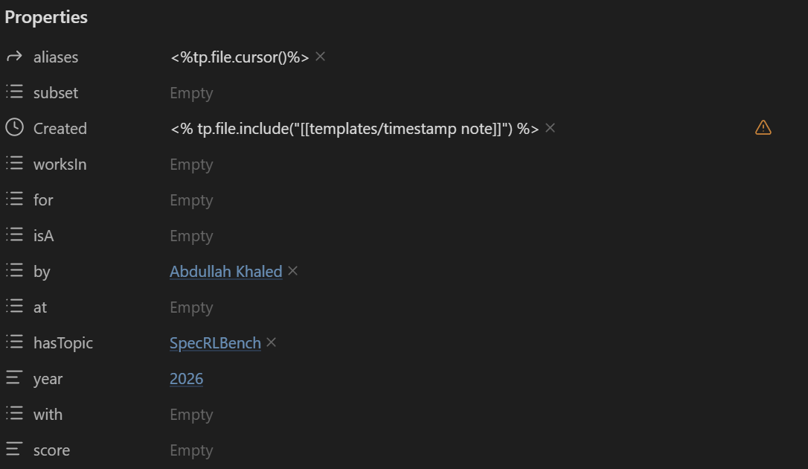
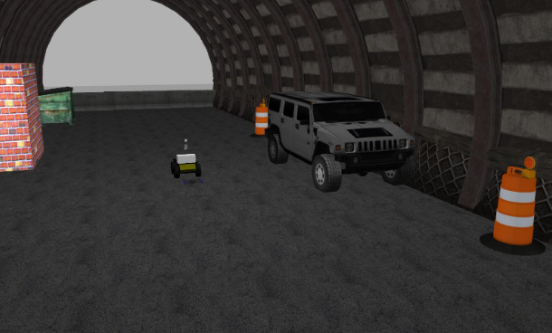
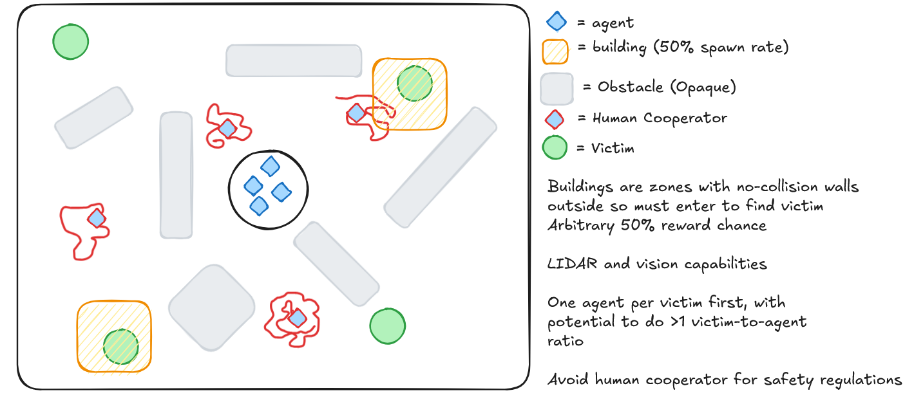
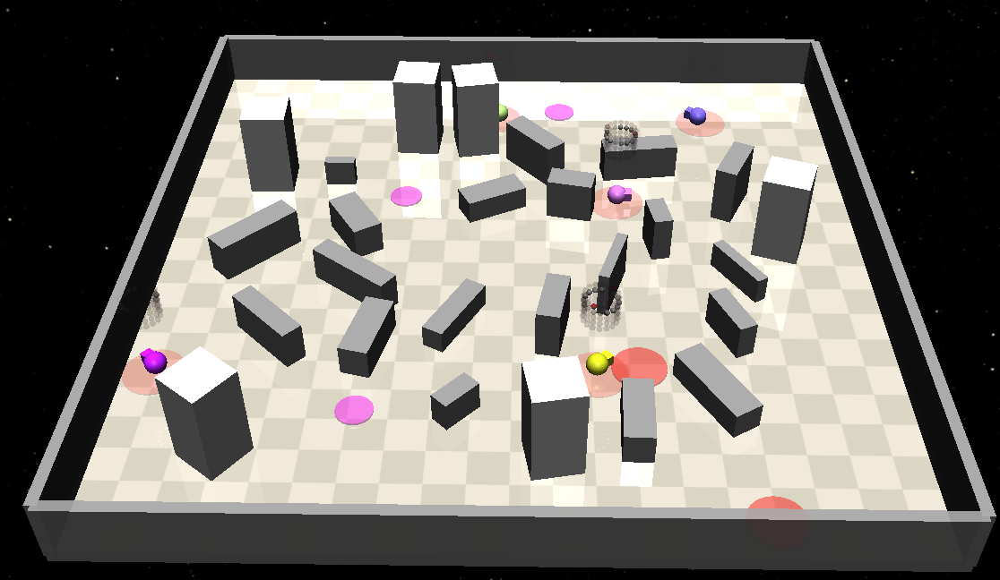
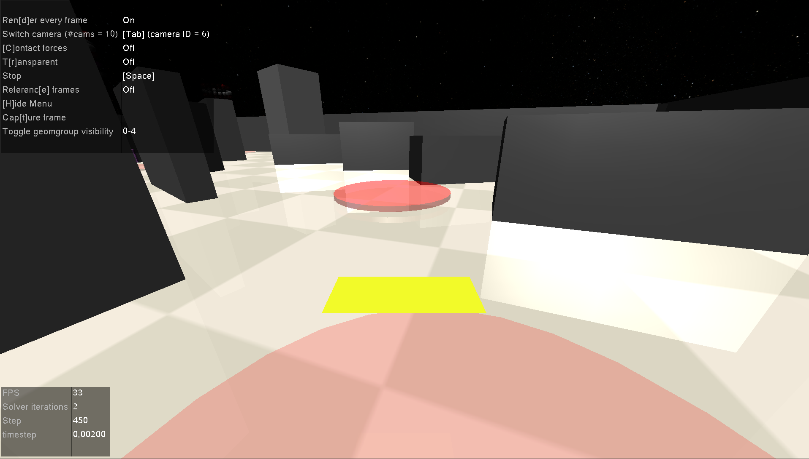
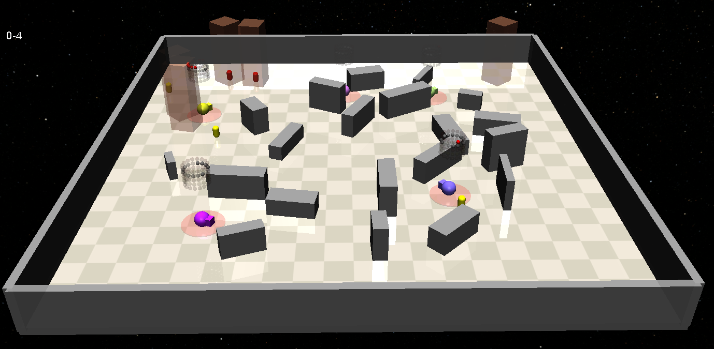
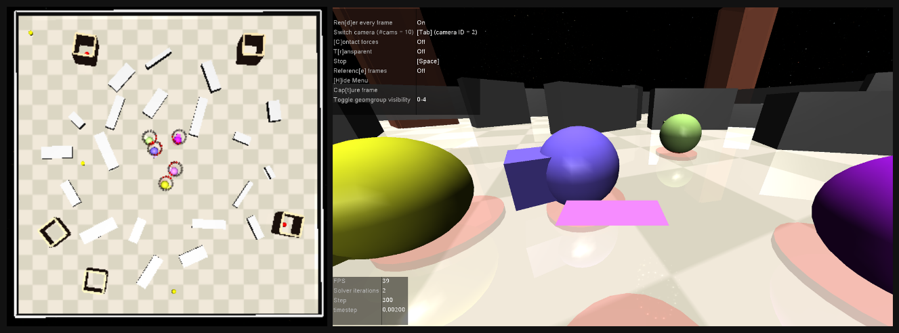
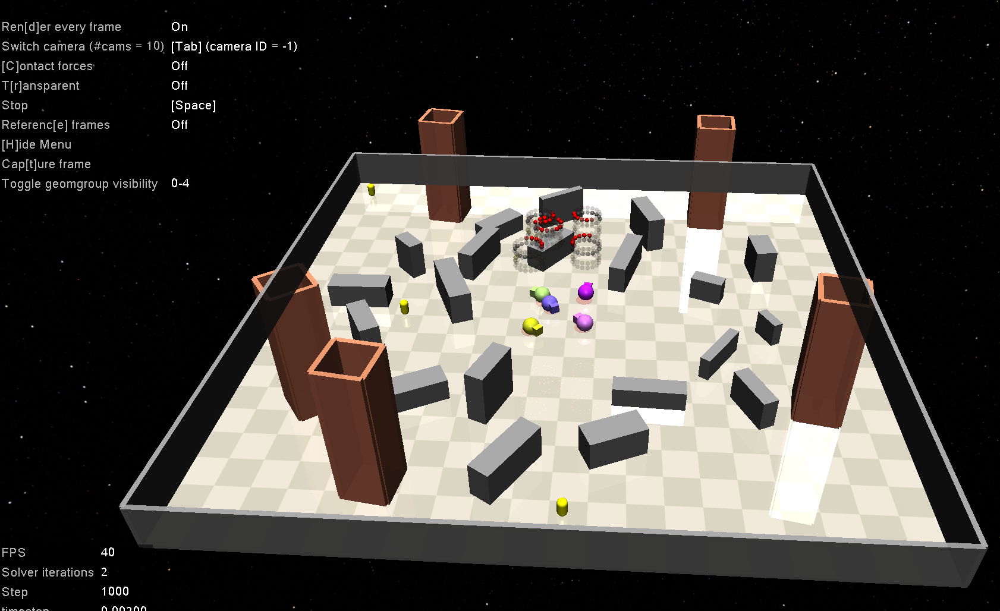

<details>
	<summary><i>Obsidian Properties Screenshot</i></summary>
	
	#rise-dcl-log
</details> 

# Table of Contents
- [Sources](#sources)
- [Papers](#papers)
- [06-29-26](#06-29-26)
	- [Old Command](#old-command)
	- [New Command](#new-command)
- [06-30-26](#06-30-26)
	- [Issues & Solutions](#issues--solutions)
	- [New Understandings](#new-understandings)
- [07-01-26](#07-01-26)
	- [Instructions for SpecRLBench Dev](#instructions-for-specrlbench-dev)
	- [Setting up SpecRLBench](#setting-up-specrlbench)
- [07-02-26](#07-02-26)
	- [07-02-06 Papers](#07-02-06-papers)
		- [Mock-Up](#mock-up)
		- [GitHub Repositories](#github-repositories)
- [07-03-26](#07-03-26)
	- [Making Walls](#making-walls)
		- [Initial Setup](#initial-setup)
		- [Ringed Placements](#ringed-placements)
		- [Random Sizing](#random-sizing)
	- [Making Buildings](#making-buildings)
		- [Initial Thoughts](#initial-thoughts)
		- [Border Placement](#border-placement)
		- [Spawning Buildings](#spawning-buildings)
- [07-04-26](#07-04-26)
	- [Vision](#vision)
	- [Casualties](#casualties)
		- [Initial Thoughts](#initial-thoughts)
		- [Surface](#surface)
		- [Entrapped](#entrapped)
- [07-05-26](#07-05-26)
		- [Custom Environment Name Creation/Changes](#custom-environment-name-creationchanges)
- [07-06-26](#07-06-26)
	- [Meeting with Zijian](#meeting-with-zijian)
	- [Agent Spawn Parameters](#agent-spawn-parameters)
	- [Pseudo Lidar Reversion](#pseudo-lidar-reversion)
	- [Building Walls](#building-walls)
		- [Manual Configurations](#manual-configurations)
		- [Automatic Configurations](#automatic-configurations)
	- [Miscellaneous Tweaks](#miscellaneous-tweaks)
		- [Naming Tweaks](#naming-tweaks)
		- [Better Building Spawning](#better-building-spawning)
		- [Color Additions](#color-additions)
		- [EOD Pictures](#eod-pictures)

# Sources
[ROS Ubuntu Installation](https://wiki.ros.org/noetic/Installation/Ubuntu) \
[Information Slideshow](https://docs.google.com/presentation/d/1C7Mwcdt3m7QfknjxOcZXIfugGhLVEKumrAQWOlkqRtM/edit?pli=1&slide=id.p#slide=id.p) \
[tf tutorials](https://wiki.ros.org/tf/Tutorials) \
[geometry msgs wiki](https://docs.ros.org/en/noetic/api/geometry_msgs/html/index-msg.html) \
[pubsub with python](https://wiki.ros.org/ROS/Tutorials/WritingPublisherSubscriber(python)) \
[frames](/_pages/rise/frames.pdf) \
[SpecRLBench](https://github.com/BU-DEPEND-Lab/SpecRLBench) \
[RISE Python Training](https://github.com/akhaled247/rise_python_training/tree/main) \
[Gymnasium Documentation](https://gymnasium.farama.org/tutorials)
[MuJoCo Creating Models](https://mujoco.readthedocs.io/en/latest/XMLreference.html)
[akhaled247/SpecRLBench](https://github.com/akhaled247/SpecRLBench)
[BURISE-26 Project Repository](https://github.com/akhaled247/BURISE-26)
[SARE Spawning Zone Desmos Calculator](https://www.desmos.com/calculator/bcqjpzneh6)
# Papers
| URL                                                              |
| ---------------------------------------------------------------- |
| https://www.intechopen.com/chapters/56080                        |
| https://arxiv.org/pdf/2506.06136                                 |
| https://arxiv.org/pdf/2308.00331                                 |
| https://arxiv.org/pdf/2604.24729v1                               |
| https://arxiv.org/pdf/2102.06069                                 |
| https://ieeexplore.ieee.org/stamp/stamp.jsp?tp=&arnumber=9220149 |
| https://ieeexplore.ieee.org/stamp/stamp.jsp?arnumber=10876050    |
# 06-29-26
We attempted to set up ROS Noetic on Ubuntu 20.04 within a docker container within a remote desktop. Initially, this is the command we chose:
## Old Command

```Shell
docker create \
 --name workspace \
 --gpus all \
 --net=host \
 -e DISPLAY=$DISPLAY \
 -v /tmp/.X11-unix:/tmp/.X11-unix \
 -v /home/akhaled/workspace:/home/akhaled/workspace \
 -w /home/akhaled/workspace \
 ubuntu:20.04 \
 tail -f /dev/null
```
However, since that did not work, we went with this command, that created a ROS Noetic container directly in Docker rather than having another layer of abstraction. So, we created a ROS Docker container in a remote desktop. 
## New Command

```sh
docker run -it \
  --name=ros_noetic \
  --net=host \
  --gpus all \
  -e DISPLAY=$DISPLAY \
  -e NVIDIA_DRIVER_CAPABILITIES=all \
  -v /tmp/.X11-unix:/tmp/.X11-unix:rw \
  osrf/ros:noetic-desktop-full
  
docker exec -it ros_noetic bash
```
After that, we had to install the rest of the ROS suite, which we completed using these commands. \ *Note: the Sawyer robot repo is years out of date, so some of the dependencies were outdated. We just tried our best with what we had and ignored the useless depends.*
```sh
apt update
apt-get install git-core python3-wstool python3-vcstools python3-rosdep ros-noetic-control-msgs ros-noetic-joystick-drivers ros-noetic-xacro ros-noetic-tf2-ros ros-noetic-rviz ros-noetic-cv-bridge ros-noetic-actionlib ros-noetic-actionlib-msgs ros-noetic-dynamic-reconfigure ros-noetic-trajectory-msgs ros-noetic-rospy-message-converter

apt install python3 python3-pip python3-venv

pip install argparse

mkdir ros_ws
cd ros_ws
mkdir src

wstool init .

apt install git
cd src
git clone https://github.com/RethinkRobotics/sawyer_robot.git
wstool merge sawyer_robot/sawyer_robot.rosinstall
wstool update
source /opt/ros/noetic/setup.bash
catkin_make

apt-get install gazebo11 ros-noetic-gazebo-ros  ros-noetic-gazebo-ros-control
ros-noetic-gazebo-ros-pkgs ros-noetic-ros-control ros-noetic-control-toolbox ros-noetic-realtime-tools
apt-get install gazebo11 ros-noetic-gazebo-ros  ros-noetic-gazebo-ros-control  ros-noetic-gazebo-ros-pkgs ros-noetic-ros-control ros-noetic-control-toolbox ros-noetic-realtime-tools  ros-noetic-ros-controllers ros-noetic-xacro python3-wstool ros-noetic-tf-conversions ros-noetic-kdl-parser

cd src

git clone https://github.com/RethinkRobotics/sawyer_simulator.git -b noetic_devel
git clone https://github.com/RethinkRobotics-opensource/sns_ik.git -b melodic-devel

rm .rosinstall
wstool init .
wstool merge sawyer_simulator/sawyer_simulator.rosinstall
wstool update

cd ..
source /opt/ros/noetic/setup.bash
catkin_make

cd src/sawyer_simulator/sawyer_gazebo/src
apt install nano
nano head_interface.cpp

cd /ros_ws/src/sawyer_simulator/sawyer_gazebo/src/head_interface.cpp line 71:
  cv_ptr->image = cv::imread(img_path, cv::IMREAD_UNCHANGED);
  
 catkin_make 
 
 cd ros_ws
 . devel/setup.bash
 roslaunch sawyer_sim_examples sawyer_pick_and_place_demo.launch
```
# 06-30-26
We are now trying to see the simulator in the remote desktop via NoMachine. Before, we had SSHed into the remote desktop using `ssh <user>@10.210-22-197`, but since we needed the Gazebo simulation visualizer to actually understand what was happening, so we had to set up a remote desktop. \
*Note: make sure you ssh out of the device before connecting with remote desktop connection
`pkill -u $USER -f Xorg`*
## Issues & Solutions
- Python 3 errors: `ln -s /usr/bin/python3 /usr/bin/python`
* Syntax error in `/root/ros_ws/src/sawyer_simulator/sawyer_sim_examples/scripts/ik_pick_and_place_demo.py`
	- Have to write `as e` instead `of , e` (three exceptions)
- We had an issue where the interpolation for the robotic arm to come down onto the block. `_servo_to_pose` was linear, which didn't work for quaternions due to unit vector math that meant that linear interpolation would make the length of the vector `!= 1`
	- Solution: we reduced the step size to 1 so that we did not have to worry about intermediate steps. since we are only working with cartesian movements, this wasn't a huge worry
- The initial block pose was inaccurate, since it was manually set by the Sawyer devs
	- We found out how to find the block pose using the Gazebo sim GUI
- The block pose was not dynamic (i.e. if the block got moved, the robot didn't know where to go)
1. Learned how `rostopic` works and found the topic that published information about the coordinates of the scene objects
	* `rostopic list`
2. Learned how to subscribe to the topic in the CLI and found the type of the message that was being published
	* `rostopic info /gazebo/model_states` >> `ModelStates`
  3. Learned about pub/sub in python (!= CLI) and how to parse the data
  4. Learned about what `tf` library does and began to implement using CLI first
  5. Then learned how to use it in code using tutorials above. also what a frame was and how to perform type manipulation (i.e. `Point` <==> `Vector3`)
  6. Had to offset the position due to unknown reasons (likely because model is somewhat inaccurate), though it might also be because of something with the simplified orientation calculations we did (*Note: Later, we found out that it was because the origin of the pose was not the center of the objects, but one of the vertices.*)
## New Understandings
* Learned more about the CLI, especially became comfortable with `nano` in Linux
* Understood `try except finally` blocks and how to handle exceptions gracefully
* Learned Python class structure through the creation of the `DataSubcriber` class
# 07-01-26
I talked with Zijian about his project and received confirmation from Dr. Li to work with Zijian on [SpecRLBench](https://github.com/BU-DEPEND-Lab/SpecRLBench), with the following instructions:
## Instructions for SpecRLBench Dev
- Try out the current SpecRLBench, getting familiar with the Gym setup
- Come up with real-world scenario-inspired examples for the multi-agent setting,
- Create the corresponding environments or modify existing environments for the examples,
- Formalize the requirements in our multi-agent spec language
- train and evaluate agents that use vision as inputs

Towards these goals, I started learning the foundational skills and frameworks that SpecRLBench is using, which I am tracking in [RISE Python Training](https://github.com/akhaled247/rise_python_training/tree/main)
As part of this training, I have learned
- Python syntax for control systems, classes, and overall how code is structured in Python
- Gymnasium: Basic setup, hyperparameters, Q-Learning, REINFORCE algorithm with Mudoco \
*Note: There is more to the training, but at this point, I received the email from Dr. Li regarding what I should focus on, so I pivoted to directly working on the SpecRLBench stuff.*

## Setting up SpecRLBench
Unlike in the tutorial, I didn't have to run `cd specbench` since the install file was in the main folder  
I also had to run these commands:
```bash
pip install -e .
pip install -e specbench/envs/panda-gym
pip install -e specbench/envs/zones/safety-gymnasium
```
instead of `./install.bash` because <u>a)</u> the script was `install.sh` and <u>b)</u> I would get this error:  
```bash
(specbench) C:\GitHub\rise_project\SpecRLBench>./install.sh
  '.' is not recognized as an internal or external command,
  operable program or batch file.
```
- ~~TODO: Learn how to make custom environments in gymnasium~~
- Create custom environment
- Lit review of current search-and-rescue operation environment definitions

I then started exploring more into the `safety-gymnasium` and its environments, and found the [Building Button](https://safety-gymnasium.readthedocs.io/en/latest/environments/safe_vision/building_button.html) environment, which seems to be similar to the search-and-rescue operations I am interested in. This env also incorporates vision (optional), which is something I can look into.

# 07-02-26

I started the day out by trying to understand how environments are created. A running list of classes I have found are below:
`builder.py` - this is the builder of the environments, which is where the world is constructed (inluding obstacles)
- `__init.py__` - this is where all of the environments are created when you run `pip install -e .` 
- `world.py` - this is the world that includes the observation space
- `\base` - this is where all of the "template" files are included
	- `underlying` - the source of all of the base files
	- `base_task` - the template for creating tasks
- `\ltl` - the directory where all of the LTL-specific tasks are created
	- `ltl_base_task` - built off of `base-task`, it allows the user to encode LTL tasks. Used by other ltl tasks in `\ltl`
- *Note: These tasks must be imported into the `__init.py__` file in the `\tasks` directory* \
After exploring the repository more, I was able to create my own custom task `multi-goal-level3` and my own gym wrapper `safety_gym_wrapper_ma_sro` and integrate them into the existing codebase. \
After that, I moved on to diving deeper into how simulation environments for search and rescue (SAR) environments are currently constructed. Below are all of the papers that I have analyzed so far to learn about how to make a new environment that would satisfy the goals outlined in the presentation provided. 
## 07-02-06 Papers
#### [Unmanned Ground Robots for Rescue Tasks](https://www.intechopen.com/chapters/56080)
Simulation uses a grid map, but also uses point-cloud mapping to construct a 3D visualization of the environment.
#### [UAV-UGV Cooperative Trajectory Optimization and Task Allocation for Medical Rescue Tasks in Post-Disaster Environments](https://arxiv.org/pdf/2506.06136)
- Trying to create tasks for multiple agents, with each task being completed individually.
- Using [[Genetic Algorithm]]s, which are better for complex environments. Selects the highest-fitness individuals and mutates them.
- Each agent is assigned one task unique to them
- Minimum safety distance away from vehicle
- Obstacles represented as circles (zones!!!), all vehicles spawn in the same place
https://github.com/Cherry0302/disaster_uav_ugv_rescue_planner
#### [Target Search and Navigation in Heterogeneous Robot Systems with Deep Reinforcement Learning](https://arxiv.org/pdf/2308.00331)
 \
>[!quote]
>The black lines denote the wall and the sphere-represented victim randomly appears in one of the two branches during the environment generation
#### [SpecRLBench.. A Benchmark for Generalization in Specification-Guided Reinforcement Learning](https://arxiv.org/pdf/2604.24729v1)
- Benchmark for testing different spectulation-guided RL models (hence [SpecRLBench](SpecRLBench..%20A%20Benchmark%20for%20Generalization%20in%20Specification-Guided%20Reinforcement%20Learning.md) name). Currently, there are 19 environments to choose from, split between **navigation** and **manipulation** tasks. I don't understand how the environments are dynamically created, so I will have to look into that.
#### [Search Planning of a UAV-UGV Team with Localization Uncertainty in a Subterranean Environment](https://arxiv.org/pdf/2102.06069)
 \
Simulation environment was more realistic (using Gazebo simulator)
- Included irregular models, but was essentially a cylinder cut in half and hollowed out
- Sensors included LIDAR and two cameras -- one facing upwards, and one facing forwards. This was done to map out the entire environment since it was a 3D space (by contrast, the [SpecRLBench](SpecRLBench..%20A%20Benchmark%20for%20Generalization%20in%20Specification-Guided%20Reinforcement%20Learning.md) workspace is effectively 2.5D)
#### [Collaborative Multi-Robot Search and Rescue.. Planning, Coordination, Perception, and Active Vision](https://ieeexplore.ieee.org/stamp/stamp.jsp?tp=&arnumber=9220149)
- Simulation for SAR environments should be more robust than traditional applications since the environment is often more complex than traditional environments.
- **Sim2Real** methods
- Important to consider noisy data, unbalanced data, and conflicting data as potential issues when abstracting away certain parameters
- May be useful to consider creating some of these disruptions within the simulator to increase its realism

(10/27) Multi-Robot Task Allocation
- Most often these are centralized, but decentralized approaches are more robust for the types of environments they operate in (especially SAR environments)
- Market-based approaches and auctions
- Liu et al. -- Potentially use a supervised system to adapt the robot when new situations occur
#### [A Heterogeneous Unmanned Ground Vehicle and Blimp Robot Team for Search and Rescue using Data-driven Autonomy and Communication-aware Navigation](https://ieeexplore.ieee.org/stamp/stamp.jsp?arnumber=10876050)
- Teams were given points based on how many "artifacts" they found and reported to the correct location (not individuals)
- UAVs and UGVs worked together to a) map out the environment and b) find the aforementioned artifacts (e.g. person, backpack, items, etc.)
- Real-world environments (not super helpful for understanding how simulations should be made)
- UAVs (blimps) were used in mazes and trajectories were mapped out

Once I finished reading those papers, I constructed a mock-up of the environment and task that I hope to complete:
### Mock-Up
 \
The obstacles, victims, buildings, and casualties will all be randomized (easier than static placements), and the agents will always spawn near the center. This way, there is a good balance between randomness (which is required to prevent an overfitted policy) and structure (since otherwise, the simulation would not be realistic).
### GitHub Repositories
##### [akhaled247/SpecRLBench](https://github.com/akhaled247/SpecRLBench)
This is a fork of the SpecRLBench repository, where i am developing the environment as explains above.
##### [akhaled247/BURISE-26](https://github.com/akhaled247/BURISE-26)
This is the repository where I'm housing the work that I have done. Currently, it just has the SpecRLBench submodule, but I may add other directories if needed.  [TODO: Ask for recommendation/permission to move repo to BU-DEPEND-LAB] 

# 07-03-26
We have off since it's a federal holiday, but I wanted to continue working on at least the task environment so that it was easier to implement higher-level features nearing the end of my internship.
I keep getting this error,
```sh
 assert all(cost[agent]['cost_sum'] == 0 for agent in self.possible_agents), f'World has starting cost! {cost}'
AssertionError: World has starting cost! {'agent_0': {'wall_sensor': array([0.01272425, 0.23717354, 0.10691148, 0.00573575]), 'cost_ltl_walls': 0, 'cost_zones_gray': 0, 'cost_zones_magenta': 0, 'cost_zones_red': 0, 'cost_collision': 0, 'cost_sum': 0}, 'agent_1': {'wall_sensor': array([0.00435828, 0.01436281, 0.31213399, 0.09471465]), 'cost_ltl_walls': 0, 'cost_zones_gray': 0, 'cost_zones_magenta': 0, 'cost_zones_red': 1, 'cost_collision': 0, 'cost_sum': 1}, 'agent_2': {'wall_sensor': array([0.05111625, 0.11643658, 0.02661322, 0.01168334]), 'cost_ltl_walls': 0, 'cost_zones_gray': 0, 'cost_zones_magenta': 0, 'cost_zones_red': 0, 'cost_collision': 0, 'cost_sum': 0}, 'agent_3': {'wall_sensor': array([0.01516125, 0.01623947, 0.08972661, 0.08376926]), 'cost_ltl_walls': 0, 'cost_zones_gray': 0, 'cost_zones_magenta': 0, 'cost_zones_red': 0, 'cost_collision': 0, 'cost_sum': 0}, 'agent_4': {'wall_sensor': array([0.05635487, 0.38731112, 0.02413932, 0.00351234]), 'cost_ltl_walls': 0, 'cost_zones_gray': 0, 'cost_zones_magenta': 0, 'cost_zones_red': 0, 'cost_collision': 0, 'cost_sum': 0}}
```
Which, according to AI, boils down to the world being too crowded, resulting in an environment that already has costs associated with it. To combat this, I reduced the number of agents. After this, I started working on making the walls.
## Making Walls
### Initial Setup
There were multiple issues I faced while I was trying to make the walls. First, I had to learn how to make a new geom. The existing wall geom was a stub, or simply a template that did not have the necessary parameters to exist in the simulated environment. So, I took the code from the `pillars` geom as a reference for creating the walls, since they share many of the same properties. Initially, here is what I had to change:
1. `size`: With the pillars, `size` was just a float value that represented the radius of the `cylinder`. However, for the walls, they were of `type: 'box'`. As such, I had to change this parameter to **`half_sizes`**, which was of type `list` that took in three variables, `[x, y, z]`, that represented how far from the center the wall would extend in 3D. This also meant that the position of the box in the configuration was `'pos': np.r_[xy_pos, half_sizes[-1] + 1e-5]`, where `half_sizes[-1]` was the final (z) element of the list.
2. `type`: As mentioned previously, I had to change the type of the obstacle to `box` so that it wasn't a cylinder.
3. `name`: The name of the geom was changed to `"walls"` since when the `pos(self)` method is called, it will return `wall_N` where N represents the index of that wall. \
This allowed me to render the wall for the first time in the simulation, which was quite exciting. They had random positions, which is what I wanted, but they would intersect with the ring that I wanted to leave for the agents.
### Ringed Placements
So, I started working on making the walls spawn in a specified ring. Below were the requirements I set:
1. The ring's inner/outer radius had to be specifiable, ideally with a +-margin of error
2. The ring had to have a hollow center, such that agents could be placed within that inner ring
3. Walls had to be able to be placed randomly along that ring: I didn't want them to spawn in the same place every time
4. Wall spawning would ideally be controlled by `random_generator.py`. This way, the initial seed would be the sole determinant of the randomness, meaning that the simulation wouldn't change between runs unless the seed was changed \
I first started with trying to understand how the `placements` attribute worked for geoms, which I found explained [here](https://safety-gymnasium.readthedocs.io/en/latest/components_of_environments/objects.html#general-parameters) in the safety-gym docs. I learned that placements are boxes, constrained by (x,y) coordinates from the origin, that specify a region that the object's origin can be located. Placements can either be a single 4-tuple (i.e. `(x_min, y_min, x_max, y_max)`) or they can be a 1D array of these regions (i.e. a `list`). However, there was an issue since I wanted a ring, I would have to take multiple samples along the ring radius and create boxes from them. Therefore, I had to convert the polar coordinates `(r, θ)` into `(x, y)` using trigonometry, then created a box with dimensions `2 * margin` around that central point. I used `WALL_COUNT` samples so that the walls would be approximately spaced around the ring, and forced the margin to be larger than the `keepout` (if no margin specified). That created an environment that looked like this:
 
### Random Sizing
However, I also wanted the sizes of the walls to be different. So, I initially created a method (taking code from the `ring_placements()` method) that allowed me to create `n` len=3 arrays that would output `[x, y, z]` so that the dimensions were random every time. That was a little *too* random, though: each run, instead of preserving the values based on the original seed, the method would return a new list of half_sizes. This was because I was using `np.random` to create the lists rather than `self.random_generator` because the latter does not initialize until after `reset()` has been called in the task.
So I changed how the random sizing was stored. Instead of a new instance of the list being created every time the `test_env.py` is run, there is a `_cached_wall_half_sizes` variable that is initially set to `None` in the class scope. Then, when the `_build()` method is called (which happens after `reset()`), `size_randomization(base_half_sizes, num, margins, random_generator=self.random_generator)` is called. This value is then cached in the task, so that when the env is run again, it loads the existing values instead. This way, for each seed `s`, the agent will see a reproducible environment, allowing the user more control over the simulation params. With those changes implemented, the following environment was generated:
 \
As you can see, the sizes are more randomized than before, and are also much more controlled in size. Since the `point` agents cannot jump over walls, (as of now), it didn't make sense for the walls to be super high. This also improves the UX, since more of the scene is visible at a time.
## Making Buildings
### Initial Thoughts
As shown in my initial [mock-up](#mock-up), I wanted to make buildings that had "casualties" in them, though I didn't want them to be directly spotted by the agent. Some of the casualties would be easily visible (i.e. in the open), while others would be inside buildings. I felt like starting on the buildings first since they house the casualties, but retrospectively I probably should have reversed the order. In any case, I knew that for the buildings, I wanted:
1. An opaque "shell" that LIDAR and vision could not penetrate. I didn't yet know, but LIDAR was going to be an interesting issue to tackle.
2. It would have to be taller than the walls. This way, when vision is incorporated into the system, they will be visible over the walls. This is yet another reason why the walls should be shorter; in real-world applications, debris is likely not going to be taller/obstructing the view of collapsed buildings, improving the realism of the simulation
3. It would need to be visually distinguishable for the user (personal preference, but better UX is good for this project, since it's for benchmarking)
4. I wanted buildings to be situated on the outskirts of the environment, but not in a ring (since the corners were good places for the buildings to go)
### Border Placement
After incorporating [ringed placements](#ringed-placements) when creating the walls, I simply reconfigured that code for the borders. Since I already had an understanding of the `placements` format at this point, it didn't take as long to set this up as it did the first time. Now, when `border_placements()` is called, it creates a "picture frame" that is hollow in the inside so that buildings only spawn on the outskirts of the SARE.
### Spawning Buildings
I was able to take the `Zones(Geom)` class and refactored it for it to become a building. The changes I made are listed below:
1. Changed the `type` to `"box"` instead of `"cylinder"`
2.  Added `placements`, `keepout`, and `alpha` parameters to incorporated `border_placements()` and visual changes
3. Slimmed down the colors to <span style="color:light_grey"><code>light_gray</code></span> (to distinguish from `gray` walls), <span style="color:red">red</span>, <span style="color:yellow"><code>yellow</code></span>, and <span style="color:lime"><code>green</code></span>, the latter three of which I hope to incorporate into my costs as more risky candidates. \
Tomorrow, I plan on making the casualties extended from the zones using `type:'capsule'`, which I think will be fun as well as informative. I plan on making some of them spawn in buildings and the rest spawn in the open. I think that casualties in buildings will have higher rewards than those outside (since in real life, they are likely in worse condition due to debris, collapsed supports, etc.). EOD, here is what the environment looks like:

# 07-04-26
## Vision
It was midnight, but I wanted to do something, and I knew that vision was already implemented in the single agent LTL environments, so I hoped that it would not be too difficult to transfer over. Here is what I changed to make vision work. *Note: vision cameras already existed on the `xml` files of the `Point` agents, so most of this was just debugging the `\base` code to work with multiple agents*
1. In the `__init__.py` file of the package where all of the envs are created, I dropped the `{PREFIX}` from the vision environment creation code so that it didn't have `"Safety"` at the start. Made it more simple when debugging.
2. In the `obs()` method in `base_task.py` I inserted the following code:
```python
if self.observe_vision:
	for i in range(self.agent.agent_num):
		name = f'vision_{i}'
		obs[name] = self._obs_vision(camera_name=name)
```
This way, the vision camera creation was agent-number-agnostic. This code was already somewhat implemented between the lidar sensors and the manual setting from the one-agent system, so I was able to extrapolate into this condition. \
After that, the vision worked! In the `obs` keys, `vision_0,1,...` is registered, and with the proper formatting (since I used `_obs_vision()`, I didn't have to configure that). However, since the camera renders with the same methods as the rendering for casualties, I made this little helper statement:
```python
render_mode = "casualty" if 'Vision' not in env_name else None
env = make_env(env_name, render_mode=render_mode)
``` 
That way, I/user don't have to worry about whether we've set the `render_mode` correctly, which makes this easier to use. 1AM Update:
 
## Casualties
### Initial Thoughts
As I mentioned yesterday,
>[!quote]
I plan on making some of them spawn in buildings and the rest spawn in the open. I think that casualties in buildings will have higher rewards than those outside (since in real life, they are likely in worse condition due to debris, collapsed supports, etc.)

But today, I wanted to get more into the granularities of what that meant. So, here were some of the criteria I outlined:
1. Uses the model type `capsule`, since that is the most representative of a casualty—though I may add a model in the future, it isn't strictly necessary as of current.
2. There should be two types of casualties; one that is outside and spawns in randomly throughout the map, and one that specifically spawns in buildings.
	1. These casualty types should also be distinguishable through some way so that when making the rewards, I can specify which one has higher reward
3. The total of these casualties should add up to the number of agents (for now). Since LTL is not yet implemented for this environment, the agent can't really do multiple tasks sequentially
4. Building casualties should spawn inside buildings (obviously) \
*Note: If looking at the code, I created the class called `Casualtys` since it would turn into `var_casualty` during the actual environment building. I know that's not how you spell it, but it made the workflow more modular.*
### Surface
Once again, I was able to reuse the `Zones` geom class for the surface casualties, simply chaging the type to the capsule and adjusting some of the color options to be more in line with what I wanted. Like the buildings, I made them opaque, gave them the ability to have custom `locations` and `placements`, and adjusted the `size` parameters accordingly.
### Entrapped
Now, making the entrapped casualties was more challenging than the surface ones, since I had to make them sync up with the building locations (which were at-time being set randomly by the [border placements](#border-placements)). The first thing I tried to do was retrieve the `pos` of the buildings. First, I head to retrieve the attributes of the Building class using `dir(self._geoms.get('light_gray_buildings')`. From there, I found out the `pos()` method, (I could've also checked the `buildings.py` class and seen it there), and was able to call it using `self._geoms.get('light_gray_buildings').pos()`, which returned a list of triples. However, I was calling this in the `specific_reset()` method since those positions weren't yet initialized in the `_build()` method. This meant that I could not modify the positions of the entrapped casualties within that reset method. \
From there, I pivoted to what I had done for the `Walls`, since those required randomized sizes that were cached at the initial startup build. I realized that I could use a similar idea to what I did there, but instead of making the sizes, I would be making `locations`. Using the `border_placements()` code as a foundation, I made a wrapper method called `border_locations()` that took in the border parameters as well as the `num` of buildings being spawned in, the `RandomGenerator` object of the task, and `keepout` for the `draw_placements()` method I recycled from the `RandomGenerator` class. The method returns "a list of (x, y) locations from the `random_generator` that can be used when updating locations in the `_build()` method of a task." \
When I first tested it out, though, the simulation would not load. At the time, I assumed it had to be because of the locations generating inside one of the other objects, and I was right! After creating a [Desmos graph](https://www.desmos.com/calculator/bcqjpzneh6) to help me visualize the parameters I had set, I saw that there was some overlap between the placements of the Walls and Buildings. After tweaking the parameters and checking the simulation multiple times, I ended up with the params you can see in the graph. The sim now loads in ~5 seconds, which is pretty good considering all of the walls, casualties, and buildings it has to loads, and there isn't interference between the objects.
#### Additional Initial Setup
Since there were more geoms I was editing in the `_build()` method, I created a `_replace_geom()` method that allowed me to replace geometries more easily in the multi-agent environment. I also made it so that there were fewer entrapped casualties than surface casualties (but still had them add up to `num_agents`) [TODO: Find more research determining this ratio and incorporate it into the environment]. I also changed the colors of the buildings to be more building-like and help distinguish them from the walls. I also added a `debug` attribute to the `Buildings` class so that I could make them translucent when I want to see if the entrapped casualties have been spawned correctly but also make them easy to turn solid (e.g. when using vision). Current progress: 
\
Next, I want to show this to Zijian to get approval to continue making the policy wrapper, which will definitely be interesting.
# 07-05-26
### Custom Environment Name Creation/Changes
Today, I wanted to get rid of the "level" part of the task name since it didn't really make sense in this context (at least for now, might change later). In order to do that, I had to follow these steps:
1. Change the name of your file to whatever you like. I tried to keep convention by naming it `multi_goal_sar.py`, but I don't think it really matters. Also, name the class something you will remember. That also doesn't matter for adding a custom naming type, but I made it `MultiGoalSAR`, again to keep convention.
2. Go to `SpecRLBench\specbench\envs\zones\safety-gymnasium\safety_gymnasium\tasks\__init__.py` and add your file and class to the import statements, e.g. `from safety_gymnasium.tasks.safe_multi_agent.tasks.multi_goal.multi_goal_sar import MultiGoalSAR`. That way, when you run `pip install -e specbench/envs/zones/safety-gymnasium`, that class will be registered and recognized by the program.
3. In `SpecRLBench\specbench\envs\zones\safety-gymnasium\safety_gymnasium\utils\task_utils.py`, add a section that looks like this, but with whatever you want to name your environment. Since this is specific to SpecRLBench, I don't know how to change it in base safety-gymnasium, but I assume it would be similar to this:
 ```python
if '<ENV_ID>' in task_id:
        return "<ClassName>"
    elif 'LTL' in task_id: #elif if important; not there normally.
	    # ...
"""My Specific Example"""
if 'LTLMASAR' in task_id:
        return "MultiGoalSAR"
    elif 'LTL' in task_id: #elif if important; not there normally.
	    # ...
 ```
4. In `SpecRLBench\specbench\envs\zones\safety-gymnasium\safety_gymnasium\__init__.py` (different `init` file, pay attention!) Add your environment. For me, since it was a multi-goal environment, I put it in that group and named it `LTLMASAR5` since I want to incorporate LTL and there are 5 agents currently in the sim. For me, I also had to specify `{'agent_num': 5}`, but if you're working with single agent envs I don't think that applies. \
Now I have a much more descriptive class and environment name than `LTL3MA5`, which was honestly mislead as well (it isn't a level 3 env, it's completely different and doesn't build off of anything).
##### P.S.
I've added the following code into `SpecRLBench\specbench\envs\zones\safety-gymnasium\safety_gymnasium\utils\registration.py`. If you ever have issues with this process or get an error like `Environment {id} is not registered in safety-gymnasium`, then you can look into this and see if you're environment has been registered. For me, I kept it broader since I had actually flipped the way the registration worked, so instead of `LTLMASAR` I had written `LTLSARMA`, which threw an error. Just so that you're aware!
```python
safe_registry_custom = []
        for env in safe_registry:
            if "MA" in env:
                safe_registry_custom.append(env)
        print(safe_registry_custom)
```
# 07-06-26
## Meeting with Zijian
- ~~*Agent spawning inner radius*~~
- ~~Change building spawning to have walls around them (extend `LTLWall`)~~
~~- *Lidar observed = false for entrapped casualties, revert to `pseudo` lidar*~~
- Policy - Use existing libraries (stable baselines; PPO) - start with simple tasks (e.g. go to a location), then expand to more complicated tasks
	- For policy training use lambda machine
- [LATER] Different env with human collaborators 
## Agent Spawn Parameters
The first thing that I worked on was the agent spawning within the inner radius, which I had briefly started before coming to the lab. At first, I tried to do what I had done previously with the buildings and walls, which is replace the existing instance of them from within the `_build()` function. However, that didn't work because the agents are actually built in a separate `_build_agent()` function that runs as part of the init method of the `underlying` class. \
So, I had to modify the existing class to add two new parameters (`placements` and `keepout`), which I was able to then use in my task init function like so: `self._build_agent(self.agent_name, keepout=0.2, placements=[(-0.67, -0.67, 0.67, 0.67)])`. \
However, even then, I was getting issues where the simulation would stall for no apparent reason. It was then that I discovered that the `gremlin` class that was being used to repreesnt the other agents had a bug in it. After digging through the code, I found that the `self.agent.get_agent_pos(i)` method it was using would always return `[0., 0., 0.1]`; meaning that these gremlins were all spawning at the center and not moving to the actual agent pos. This was causing issues because since the gremlins wouldn't move and they were very close to the agents, there wasn't space for both to coexist. So, I had to use the world engine (via `self.engine`) and find the agent's pose data from there, since that class is updated every step, not just at initialization (i.e. `agent_xy = self.engine.data.body(f'agent_{i}').xpos[:2]`.   \
You may notice that instead of the `ring_placements()` method, I just have a box with the bounding values in it. I found that since I've already created a [graphing helper](https://www.desmos.com/calculator/bcqjpzneh6), I could just plug numbers into there until I found the box size that maximized the space. This way, I wouldn't have to worry about complicated geometry and in the end, it would likely not provide much benefit.
## Pseudo Lidar Reversion 
Making the entrapped casualties not visible to the lidar was quite simple: all I had to do was change `self.is_lidar_observed` to be conditional on `category != list(self.CATEGORIES)[-1]`, since the last index of these categories should always be the value that is for the `entrapped` casualties. When I print `obs[a]` every step, the keys I see for lidar are: `buildings, surface_casualtys, walls, gremlins`: no `entrapped_casualtys`, meaning that this one-line change was the fix.
## Building Walls
### Manual Configurations
Once I had the agents working as intended, I wanted to make walls enclose around the building propositions so that if an agent enters a building, they can still see the entrapped casualty with lidar or vision. \
The first action I took was to add additional parameters to the existing`ltl_walls` class, since that was most similar to what I wanted to do: four walls spawning around a central point. 
1.  `locations`: I knew that I was going to have to use it to put the walls exactly where the buildings were.
2.  `x_offset`, `y_offset`, `theta`: So that I could move and rotate the wall wherever I wanted.
3. `height`: Since the building walls were going to have to be taller than the existing border walls. \
Once that was done, I tried actually using these inputs to rotate and translate the walls to a configuration I manually inputted.
4. I had to use a rotation matrix to rotate the locations after using the offsets to initially offset them, which made the final locations out to be
```python
(x - self.d_x) * cos_t - (y - self.d_y) * sin_t + self.d_x
(x - self.d_x) * sin_t + (y - self.d_y) * cos_t + self.d_y
```
5. I also had to manually calculate the rotations for each walls using `np.arctan2(y - self.y_offset, x - self.x_offset for x, y in self.locations`, since random rotations wouldn't work
### Automatic Configurations
#### Translation
Once I successfully changed those, I was ready to move on to integrating them with the existing building code. The first way I tried to make that work was to make a custom method, shown below:
```python
def _add_n_geoms(self, n: int, geom: Geom, base_name: str, *kwargs):
	for i in range(n)
		self._add_n_geoms(geom(kwargs, name=f"building_ltl_walls_{i}"))
```
This did not work. According to AI, it has to do with me trying to call the `geom` parameter even though that isn't how Python classes work, and the `kwargs` shouldn't be utilized in that way. Because of this, I went to a simpler for loop within the init function:
```python
for i in range(self.agent_num):
            self._add_geoms(LtlWalls(name=f"building{i}_ltl_walls"))
```
You'll notice that the {i} is not at the end of the name, as you may expect (and as I did, too). Initially, I had it as `f"building_ltl_walls_{i}"`, which I found out later did not work. \
 For now, though, I used the same for loop to initialize the building walls with the locations from `self._cached_building_locations[i]` so that each instance wouldn't try to sample an incorrect location and "double up" on a single building. \ 
 However, when I ran the code, all of the walls were spawning in the same place. I was incredibly confused for a long time, but then I realized that since I was spawning multiple instances of the wall, it was cutting off the last character--the {i}. So, when it would get the location from the config for that instance, it would actually just get the location of the *first* instance created. Once I fixed that, though it was working as expected. \
 *Note: I changed the offset variables to d_y and d_x so that it's more concise in the code; they stand for delta_y/x respectively*
#### Rotation
 Once I figured out the bugs with the translation portion, I could move on to the rotation part. After digging around in the `random_generator` class (since that was where the `draw_placements()` method was found), I found the `random_generator.generate_rots(n)` method, which was exactly what I was looking for. I made another variable called `_cached_building_rots`, passed in the function with `n=self.agent_num`, and passed that into the Buildings geom that I was already creating in `_build()`. I could then use this same variable and pass it into the building walls, but it didn't work out of the box. \ 
 That's because the rotation matrix took in one angle `theta`, not a list of them. So, I created a `h_index` (for high index) that parses the name given by the user for a number and uses that as the index for searching through the `rots`, which worked quite well. Once theta was calculated, the rest of the code was already tested, which meant that I had set up the environment how I wanted to! 
## Miscellaneous Tweaks
There were more misc. tweaks than previously, so I decided to clump them together here.
### Naming Tweaks
I had an unusual number of tweaks I made to names of parameters, keys, and classes, so here they are:
- **Policy**: Changed the policy class name from `SafetyGymWrapperMASRO` to `SafetyGymWrapperMASAR` to match established naming convention
- **Building Cost**: Fixed a bug that made the name of building costs the RGBA array for the color; changed to `self.color_name`  as it should be
- **`sar_utils` Methods**: Renamed the `thickness` parameter on border-related methods to `margin` for parity with ring-related methods
- `WALL_MARGIN`: Renamed the `MARGIN` parameter in the task to `WALL_MARGIN` so that it was more descriptive.
### Better Building Spawning
With the way the simulation was currently set up (i.e. the seed), there were two buildings that were spawning inside one another (see pictures above). However, there was plenty of space at the bottom of the sim for a building to go; it wasn't being used, though, since the placements are randomly sampled and that sampling had led multiple buildings to spawn in the same quadrant, causing the clumping seen. To make them more spread out, I manually forced each iteration to move into the subsequent quadrant using this method:
```python
def draw_border_placement_from_loop(
        side_length: float, 
        margin: float, 
        keepout: float,
        i: int, 
        random_generator: RandomGenerator):
        
    return random_generator.draw_placement(
            placements=[border_placements(side_length, margin)[i%4]], 
            keepout=keepout
            )
```
### Color Additions
Added <span style="color:#e27d5b">terracotta</span> to the list of colors for use in the building walls.
### EOD Pictures
I wanted to include two pictures this time: one of the top-down view of the sim, and one of the FPV of an agent in the sim. That way, it's easier to see the difference, since from afar, it looks pretty similar. In these pics, you can see both of the entrapped humans (from up here red specks), making the UX a lot better too.




--- 
#project/idea 