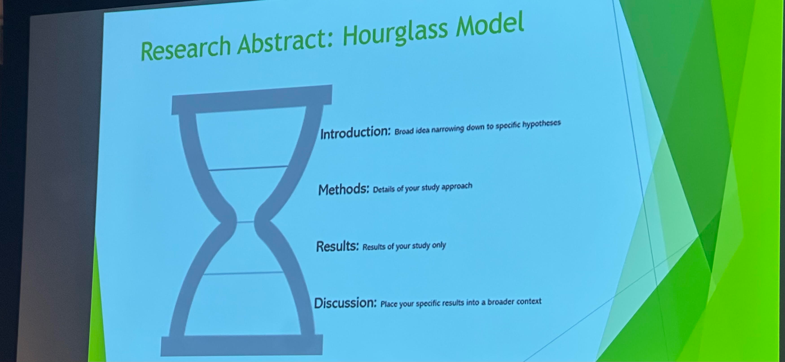
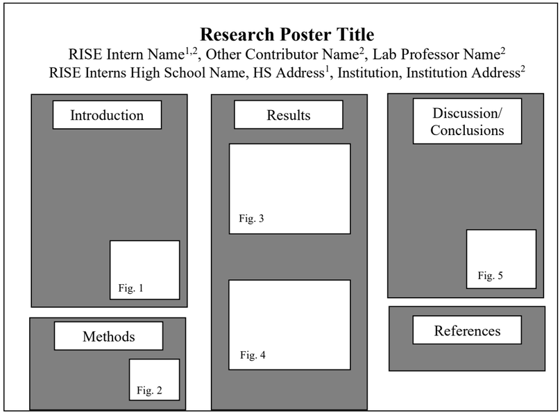
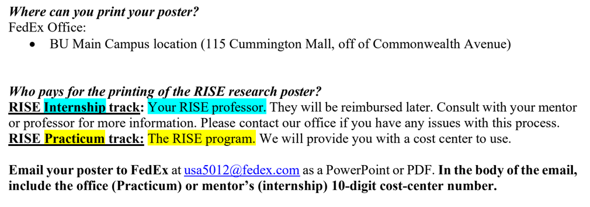

[2026 Research Abstract and Poster Handout.pdf](https://drive.google.com/file/d/1ht7xa6OXoHLYQ7HXaRQ5c6Dn2hxZ4H1P/view?usp=sharing)

# Abstracts
>[!tip] Abstract due by Thursday, July 30 @ 3PM via Word Document

 >*"LASTNAME_Internship_Abstract"*
 
 **200-300 word** summary (i.e. comprehensive overview) of your research project, with an emphasis on the project objective and findings. It is meant to help a reader determine whether your paper is worth reading. It also helps prepare readers to follow the detailed information while reading your poster. It can help readers remember key points from your poster, since they already have a "high-level overview" of your project.
 **Includes:** research question(s), methodology, key results, conclusions.
 **Formatting:**
 - **Initial:** Line 1 = Title || Line 2 = Contributors || Line 3 = Institutions with addresses
 - Single-spaced, extra lines between title, names/affiliations, and body
 - **Numbers** (i.e. footnotes) are superscripted
 - **Font:** Title = 14pt || names/affiliations/body = 12pt || Times New Roman 
 - **References** in abstract can be included and won't count to word count 
 - **Format:** Word document

---
## Content
- **Background**: What do we know about the topic? What is the problem or  gap motivating the resarch project?
- **Research Question**: What is the study about? What is the question you are investigating? What is the project's aim?
- **Rationale**: Why is your research important?
- **Methodology**: How was the study done? What methods did you use?
- **Results**: What was discovered?
- **Conclusion/Implications/Recommendations**: What do your results mean? What is the broader significance of your findings? What are potential next steps?

## Best Practices (6 C's)
- **Compliant** - Follows max word limit and submission guidelines
- **Complete** - Covers all major parts of the project
- **Concise** - Avoid wordiness or unnecessary information
- **Clear** - Readable , well-organized, and limited jargon
- **Cohesive** - Flows smoothly and logically
- **Correct** - Correct spelling and grammar
## Writing Style
- Use an Active Voice
- **Third Person** (researchers) OR First-Person Plural (we)
- Present Tense when referring to results (e.g. "The results suggest")
## Example
- Vaguely Written: No background information or context ;lacks speicficity; no quantitative results; informal

# Poster
>[!tip] Poster due by August 4th by 3PM
> Symposium from 10:15 AM-3:00 PM

 >*"LASTNAME_Internship_Poster"*

A more detailed (between abstract and scientific paper) "illustration" of your research project. 
**Sections:** Title, introduction[^1] materials and methods, results, conclusions, references, and acknowledgements.
[^1](which usually ends with the research objective(s) or question(s))
**Format:** PDF or Powerpoint
- Presented at academic conferences/symposiums to receive feedback before publishing a journal article
- Summarizes research concisely and attractively
- Mixture of **brief** text with tables, graphs, pictures, etc. 
> [!warning] MAKE SURE TO CITE EXTERNAL SOURCES, INCLUDING GRAPHICS
- Highlights motivation, methodology, results, and conclusions of a research project
## Best Practices
- Information should be readable from <5ft away
- Title is short and interesting
- Word count of 400-800
- Text is clear, concise, and to the point (same style as Abstract)
- Graphics must be effective and relevant
- Consistent and clean design and color choice
## Poster Design

- **Clear Flow**: Organized in three columns (priority) and proceed from left to right
	- Consider including a number in each panel (e.g. [1] introduction [2] Methods)
- Choose a neutral background color/patterns
- **Title and Authors:** Title should be largest font of poster and describe project; Include all authors and [middle initials (optional)]; Institutional affiliations and addresses
- Introduction: Background information >> Schematic or figure to easily convey problem (maybe)
- Methods: Description of what you did with explanatory figure, if applicable
- Results: Highlight 2-3 major results, NOT every data point >> Include plots/figures that convey results easily
- Discussion/Conclusions: Restate main findings and provide context for how results move field forward
- References: ACS Format for any citations used in poster
- Acknowledgements: Funding sources, scientists who supported work but are not authors, land acknowledgement: BU CRC is on ancestral homeland of Pawtucket, Massachusetts, and Wampanoag tribal nations
- Abstract: Not necessary since poster is ~ extended abstract
## Other Considerations
- Make Comprehension Easy
	-  Target Audience: Both experts and non-experts
	- Amount of text (400-800 words)
	- Can someone understand poster if you aren't present
## Printing Poster

--- 
#project/idea
